Wilfrid's War

Preface

In telling the story of my grandfather's World War One experience, I
decided to go beyond his personal experience, which, while interesting
from a family-history point of view, would be richer aif merged with a
larger narrative of Canadian military history of that time.

Wilfrid's active-service letters -- written from his entry into battle
in April 1916 to his wounding and conveyance back to England to recover
in early October of that same year -- clearly convey the evolving trauma
of his life in the trenches, and, along with that, a growing bitterness
and somewhat disturbing -- if inevitable \-- blunting of emotion. The
letters themselves, especially those written during Wilfrid's active
service at Ypres and the Somme, could only relate a small part of his
experience of war. Wilfrid had to be careful that his letters only
focused on private and family matters. Military censors (regimental
officers) reviewed every letter from the field prior to its posting to
ensure no mention was made of troop location or operational details of
specific military activities that could prove of value to the enemy.
Forbidden information included references to locations, numbers of
troops, criticism of superiors and even the weather (which might
indicate the state of the trenches).

In recent years, a large amount of information about Canadian military
operations during World War One has become public knowledge. Of
particular interest are the records in the form of daily entries by
battalion, brigade and divisional leaders into official war diaries.
Documenting the events of each day -- which would include the numbers of
those killed and wounded, the enemy action behind that carnage and
specific details of retaliation efforts -- was an important leadership
task at the battalion and brigade levels. At the Division level, we find
operational and strategic papers, as well as diary entries by divisional
commanders (i.e., generals).

I've included this wider perspective of larger troop movements and
operations, and daily trench-level activity to provide a more complete
and accurate picture of Wilfrid's experience than the letters alone
could provide.

I also to decided to include details about the fate and experience of a
few other Neepawa men, who had been friends and neighbours of Wilfrid's
that he mentions in the letters, in order to more broadly capture the
impact of the war. Neepawa itself was hit hard by the war. In 1911, its
population was 1,800 and it lost 120 men over the course of WW1. The
population had grown by 400 by 1941, but only 73 men died during WW2. I
include stories of Wilfrid's friends who died, were more seriously
wounded or suffered from acute trench-related disease.

I've also included a discussion of and out-takes from the letters of
Wilfrid's best friend (and surrogate brother), Richard Buckley.

A Note on the Scanned Letters

I've been careful to scan every letter Wilfrid wrote with only a few
rare exceptions: I did not scan only a handful of letters that were
addressed to either his sister May or his mother, Nellie, if they
contained identical information. I also didn't scan any letter written
of legal-sized paper that begins at the top of the page (only one so
far) because that size of paper simply doesn't fit on my scanner.

Many of the letters, particularly those written on the battlefield, were
written in pencil and under duress, so they're not all that legible.
I've tried to remedy this by tweaking them with the software editing
tools available with my scanner. These tools increase the contrast or
fill in faded lines with additional pixels. In some cases, it much
easier to read the scanned letters than the originals.

When Wilfrid was declared unfit for active military service and took up
full-time clerical work in for the Canadian Casualty Assembly Centre
(C.C.A.C.) in Folkestone (January, 1917), he starts to type many of his
letters on office stationery. His letters become more detailed,
thoughtful and voluble, as well as much more legible at this point. He
appears to have been a natural-born typist and expressed himself more
freely and volubly when freed from the labor of writing with pen or
pencil. And, of course, he no longer had to worry about his letters
being closely reviewed by officer censors either.

Wilfrid Dunlop, a 23 year-old clerk from Neepawa, enlisted to serve in
the Canadian Expeditionary Force on August 9th, 1915 at the Winnipeg
Recruiting Office.

Wilfrid appears to have been officially known both as Wilfred and
Wilfrid. Even his best friend, Richard Buckley consistently referred to
him as Wilfr**e**d in all his letters, and, clearly he had to fight his
whole life to be called Wilfrid instead of Wilfred. Here, I'll refer to
him by the name he preferred. Wilfrid chose to spell his Christian name
in the English style, perhaps in imitation of Wilfrid Laurier, the
dominant Canadian politician of the era, much admired by Wilfrid. During
the war, Laurier was the leader of the Liberal party in Canada, and he
fiercely opposed conscription, as did Wilfrid.

This is the story of Wilfrid's war, but it was hardly a unique
experience. Like many other young Canadian men, he may have tried to
enlist at the outbreak of the war but not been accepted until 1915.
Enthusiasm for joining up in the opening days of the war in August of
1914 was incredibly high in Canada, and many more young men attempted to
enlist than could be processed and accommodated. Within a month of the
1914 recruitment call for 20,000 volunteers, nearly twice that number
had signed up, and the military were forced to suspend enrollment. It's
interesting to note that over twice the number of Neepawa men enlisted
for the first world as for the second. Diminished love of empire
certainly played a part, but the bitterness and disillusionment
experienced by everyone after WW1 no doubt played the lead role.

{width="4.995cm"
height="8.313cm"}Colonial Anglophilia and love of empire were powerful
forces in a population that was either born in the U.K. or were
first-generation Canadians. It's estimated that at the outbreak of WW1,
there were over one-million British-born citizens in Canada who retained
a strong loyalty to their mother country. And, for the Canadian born,
the romantic notion of taking part in heroic battles on the world stage
while defending the civilized world from an evil aggressor was just too
strong to withstand.

Wilfrid's earliest letters from Belgium, before war-weariness and
bitterness set it, often refer to his disbelief that he was part of
something so large and important. The life of a young clerk living in a
small-town backwater of a country that was itself a backwater must've
seemed awfully dull in comparison to the good vs. evil struggle that was
consuming the entire civilized word. Also, much more personally and
closer to home, it provided Wilfrid with an opportunity to redeem
himself in the eyes of a skeptical family that considered him a
good-time Charlie, lacking in ambition and perhaps in moral fibre and
"character", too.

To a 23-year-old clerk living in a small town in one of Canada's least
interesting provinces, it would be a compelling opportunity to launch
himself onto the world stage -- and in the process redeem him in the
eyes of a father who had long favored his older, more serious and more
educated brother, Blake.

Wilfrid and his friend Richard joined the 78^th^ battalion (Winnipeg
Grenadiers) of the second contingent of the Canadian Expeditionary Force
-- which had become an urgently needed as reinforcements for the first
contingent, the ranks of which had been depleted by participation in the
major battles of 1915 \-- the second battle of Ypres, Gravestafel, St.
Julien and Festubert.

Richard and Wilfrid were sent to Camp Sewell, near Carbery, Manitoba.
His letter from the training camp reflect a tough, "very strenuous"
rather spartan existence that was hard "for one who is used to easy
times" in Neepawa.

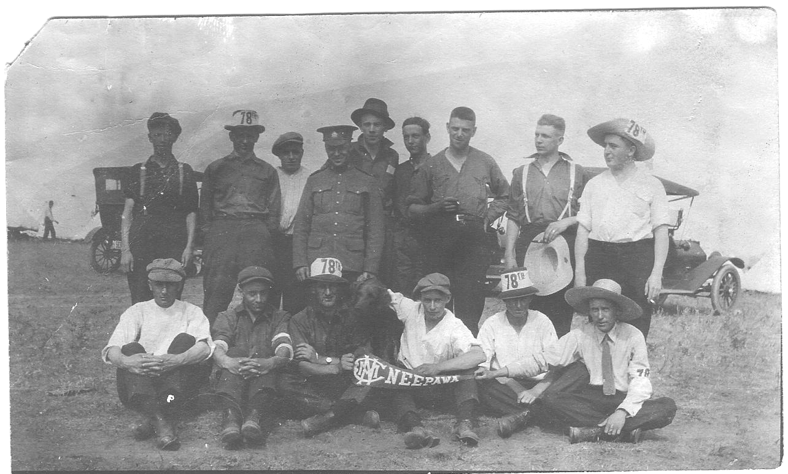{width="16.351cm"
height="9.843cm"}

Check Out the Portly Kid in the Cowboy Hat!

Wilfrid's Training Unit at Camp Sewell (Carbery, Manitoba)

Wilfrid looks relaxed and happy in the training-camp photo, sporting his
78^th^ Battalion cowboy hat while smoking a cigarette with apparent ease
and confidence. He's clearly the only overweight recruit in the group,
training must have been difficult indeed for a clerk used to an
exclusively sedentary life.

According to Leona Dunlop, Wilfred really enjoyed the good things in
life, from dressing well to eating well, and, while he doesn't directly
complain about the quality of the food when he wrote to his mother, he
did allow as how "one boy in our battalion dropped dead yesterday while
drilling, partly on account of the heat and to a certain extent through
lack of proper nourishment." He added, "since then they have been
serving us better meals."

The constant drilling in the fierce heat of a Manitoba August and
September finally came to an end in mid-September. He traveled by train
and foot marches to Quebec, and thoroughly enjoyed the trip. It was his
first experience of really seeing vast stretches of the country from
west to east. "It is a wonderful country," he concluded, "and it seems a
shame to leave it."

The first leg of the trip was to Winnipeg, where he had a half-hour
stopover. He wired his sister May and her husband, Bill, and they drove
to station for the last visit with family that Wilfrid would enjoy for
nearly five years. He was closer to his two sisters and his mother than
to his brother and father. Although we don't know for sure, the family
story was that Alexander Dunlop never once wrote to his son either
before, during or after his stint of active duty -- and vice versa.
Wilfrid wrote freely and often to his mother and sisters, and seems to
have had a very close relationship with them all.

At 5 a.m. on September 25^th^, Wilfred set sail from Montreal on a
massive ship called the S.S. Corsican.

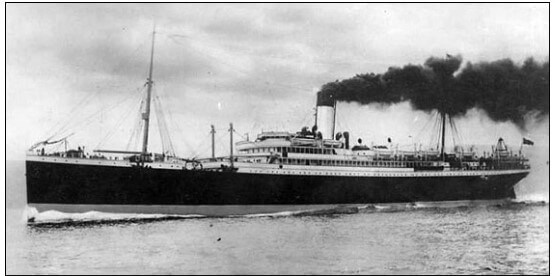{width="14.684cm"
height="7.303cm"}\

Despite its Mediterranean name, the Corsican was an Irish passenger ship
that had been seconded by the Canadian government to assist in the
first-ever conveyance of an entire country's militia across the Atlantic
to support the allied effort to vanquish German aggression. Like most
trans-Atlantic passenger ships of that period, it had been used to
transport U.K. and European emigrants to North America. It had a large
steerage section on the bottom deck that could accommodate 1500 steerage
(third class) passengers in the bowels of the ship, and 400 second class
and 200 first class passengers on the upper decks.

Wilfrid was assigned to join the 32^nd^ reserve battalion, as a
second-wave of reinforcements to replace those who had already died at
the front.

He gave his family his address as follows:

Pte. W.L. Dunlop Reg. \# 148158

78^th^ Reinforcements,

32^nd^ Reserve Battalion,

Risboro Barracks,

Shorncliffe, Kent, England.

He resides at Shorncliffe for many months, not actually leaving for
France until March 15, 2016, when he was assigned to join the 5^th^
battalion of the 2^nd^ brigade, Canada's First CEF division. Training
was a boring routine of marching and drilling, the longest marches being
15 miles long (often at night after a day of drilling) wearing his full
pack. In most of the letters from this long training period (October to
March) his tone is weary from physical tiredness and also from the
unending dreariness of training: "All I have time to do here is eat,
sleep and work". His letters from this period focus on his homesickness
and pleas for more letters, an ongoing need for cash (requests were
almost always addressed to his sister, May, rather than his mother) and
the rigors and hardships of "range" training. He seems genuinely
impatient to get to the front.

In early January he was offered a job "on headquarter staff" but turned
it down. "I have gone this far with soldiering and I am going to see it
through." His evident clerical and typing skills made him an obvious
office asset, and, throughout the majority of his time overseas, the
army clearly prized his skill with a typewriter over his "soldiering",
keeping him in medical records rather than moving him back to France.
Many of his buddies were also wounded, but they ended up going back to
the front lines -- even before they were fully restored -- and, as a
result, many of them died or were horribly wounded. While he was
thrilled not to have to return to the trenches after his leg injury sent
him to "blighty", he also clearly felt like he had been permanently
sidelined by the high value assigned to his clerical prowess -- and this
rankled somewhat, but not enough to ask to be sent back into the action.

By this time, he had moved from Shorncliffe to billets in Lyminge, Kent,
about 5 miles from Folkestone and the English channel. The first billet
was a little rough but the second billet, to which he was moved later in
January, was "an elegant place" where "the people are very nice" and
"they surely do feed us good." In the same letter that announced the new
billet, he described "a severe jolt" in the form of a government decree
that all those serving in the Canadian military would have their pay
reduced by one-half:

The balance is kept for us by the government and when we return from the
war it will be given to us. It sounds pretty fishy to me. If we don\'t
come back, the government keeps it. Some graft!

On January 24^th^, Wilfrid was informed he had to return to Shorncliffe
barracks to take advanced training in "trench digging, bomb throwing and
bayoneting", and wait for the formal draft announcement. It was to be a
fairly long wait of about six weeks. He came close to being sent earlier
but some odd happenstance consistently prevented it from happening.
Apparently, you had to respond to the draft in person to qualify, and
once he was one duty away from the base and another time a superior
officer, who would not qualify to fight in the trenches, requested to be
reverted in rank so he could go -- and he took Wilfrid's draft place.

Finally, on Tuesday, March 14^th^, he went to France. When his name was
called to sail to the front lines, his tone is nearly jubilant -- which
is not surprising given how long he'd been cooling his heels in England.
The dull repetitive nature of the seemingly endless training maneovres
and duties certainly played its part, but Wilfrid seemed more than
relieved, he seemed positively buoyant.

His optimism and relief are clearly expressed in the March 4^th^ letter
to his mother:

I am mighty glad of the change, although it means harder work and all
that but I am feeling fine and am not worrying about what is to come. I
am going to do my best and only hope that I will be lucky enough to come
through it all. Don't worry about me. I will be alright and will write
each week as usual.

Finally, this small-town Canadian boy was about to step onto the world
stage and take part in the largest conflict in history. On a grimmer
note, he is clearly aware of the central part that luck will play in
enhancing his chances for survival.

In his letter to his sister May on March 11^th^, he states that he's
"delighted with the prospective change and am fit and ready for what may
come." In this letter he doesn't mention luck, though, he says, "it all
remains with myself now." He waxes a little more emotional when he
writes to May; and we note again that he's much less straightforward in
his letters to her and more reflective . He says:

I am feeling fine\...and am taking good care of myself. I cannot afford
to abuse my constitution in any way as I will need all my wits about me
when I go to the trenches, and, believe me, I am going in to the thing
with all my heart and soul. I have a chance now to make up for some of
my follies and I tend to take advantage of the opportunity.

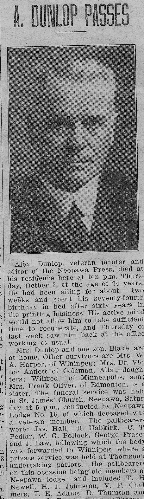{width="7.362cm"
height="25.472cm"}It's clear that the war was, for Wilfrid as for many
others, an opportunity to redeem a misspent youth and an accumulation of
"follies" in the eyes of his family and his town. He could show them
that he was made of the same stern stuff as his father and that
Victorian generation of hard-working, unrelentingly joyless pioneers.

In almost every letter to May, Wilfrid alludes to a debt that she is
actively paying down for him from his pay:

When we are warned for draft I am going to renew that assignment to you
at the rate of \$25.00 per month. As soon as you have Glass paid up you
can start sending me cigarettes with the money.

At that time a lack of frugality signalled serious defects of character.
To have amassed debts at this young age of 24 certainly suggest he was
living beyond his means and this, coupled with a lack of discipline,
seriousness and ambition (he stated his calling as "clerk") would not
have sat well with a family that was known for high-minded rectitude and
industry.

His father, Alexander, was a driven, ambitious man, the founder and
publisher of the Neepawa Free Press, a highly regarded pillar of the
small-town society of Neepawa.

When Alexander died, two months after the birth of Wilfrid's twin sons,
Bill and Bob, a front-page obituary praised him for his vigor, industry,
morale purpose and dedication to progress. Alexander's newspaper, *The
Neepawa Free Press*, begun 34 years before, had made a huge impact on
his community ("no-one did more for his community"). His energy and
industry paid off with recognition: In 1921, the paper was awarded the
prize as the best published weekly in Western Canada.

He was a Liberal party stalwart and "held offices in local organization,
and gave his time and strength without reserve for the public
welfare....he will be remembered as one of the best citizens of the
province." He was a member of the Canadian and Manitoba Press
Associations, the International Order of Odd Fellows, and the Anglican
church. He served on the Neepawa town council and played lacross with
the Winnipeg Lacrosse Club.

Alexander was a self-made man, who had strong beliefs about the value of
community service, who would brook no fault, flaw or laxity in "civic
management" and would pursue perceived corruption or wrong-doing in a
"pugnaciously aggressive" manner in his newspaper. This was not a father
who would easily forgive a son's moral transgressions.

Nor was he what we would call today a hands-on father. Rumor has it that
Wilfrid never once received a letter from his "papa" Alexander, and
while he mentions him occasionally in early letters, his name does not
appear often for the remaining years of Wilfrid's military service. The
only time Wilfrid mentions anything like a fond fatherly reprimand, it
was his brother, Blake, to whom he refers. I suspect Blake, who was 11
years older than Wilfrid, was a warmer and more constant father figure
to Wilfrid than Alexander.

In an amusing postscript to a letter written to Nellie a month after he
was wounded at Courcelette, Wilfrid explains that the hospital in which
he's being treated (the Newcastle General Hospital) had previously been
the "old Newcastle Work House. "Do you remember whenever I used to buck
at hoeing potatoes or moving the lawn how Blake used to say that "some
of these days you will end up in a work house." Well, here I am. His
words came true." His son Robert would often suggest that our family in
Calgary might end up in a work house, as well, so those words clearly
became part of the Dunlop family lore.

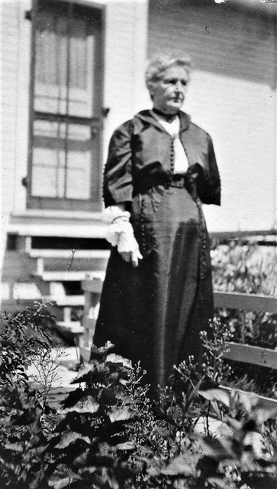{width="7.17cm"
height="12.631cm"}One suspects the Dunlop household in Neepawa was not
especially tolerant of laziness or weakness. In a letter to Wilfrid's
mother from Risboro barracks (one of the Canadian barracks in the
Shorncliffe training camp near Norfolk), Wilfrid's best friend, Richard
Buckley, mentions that he and Wilfrid regularly attended a Sunday
evening choral concert in the nearby village, and added this comment:
"It may seem a wicked way to spend our Sundays, but one might do much
worse." This suggests that the Dunlop household was a strict one. Even
in 1916, strict religious observances were breaking down. The Roaring
Twenties and the age of jazz that followed the Great War didn't emerge
from a vacuum. The Dunlops, however, were staunch C. of E. and likely
frowned on hedonism \-\-- or at any activity that violated Victorian
convention.

Alexander was a man of outspoken, high-minded principles, and it's not
surprising that he appears to have disowned Wilfrid for his "follies"
and his pleasure-loving ways, while grooming his eldest son to take over
as publisher of his beloved paper. It's interesting to note that when
Wilfrid did finally return from England in 1919, he more or less left
directly for Minneapolis. His discharge papers state that he wanted to
work as a salesman in Toronto upon his return to Canada, but Toronto was
likely just as job-poor as Winnipeg.

Just like after any other war, there were precious few jobs for the
returning veterans, and fierce competition for those. Minneapolis was a
boomtown in the 1920s, and many fortunes were made in lumber and
wheat-milling. General Mills, then known as Washburn-Crosby, was
headquarted there,

He returned to Neepawa for a short time to act as the business manager
for the paper, but only after his father had died. Blake was printer and
executive editor and Wilfrid was the manager, but this relationship
didn't last long, and by 1932, Wilfrid had moved to Winnipeg to work as
a government clerk.

Family lore (as related to me by Wilfred's son, Robert, has it that
Alexander did not once write to his son throughout the duration of the
war. His eldest son, Blake, was groomed and raised as the successor to
the business, and Wilfred had nothing to do with it at all until
Alexander's death in 1930 (just one month after the birth of Wilfred's
twin boys, Bob and Bill.

Wilfred was clearly viewed as the morally weak black sheep, dissolute
and maybe irredeemable. According to his wife, Leona, my grandmother, he
loved to dress well and was a clothes horse. If his military record is
to be believed, Wilfred also enjoyed drinking (he was charged twice with
"being drunk in the high street." While we don't have anything much to
go on beyond his own acknowledgement of his "follies" and the ongoing
struggle to pay off a large debt to a certain Mr. Glass, and a marred
military record, Wilfrid had clearly out of favor with the old man.

Early Days in the Trenches with the Fifth Battalion

Wilfrid had joined the 5^th^ Battalion, as a part of the Canadian First
Division, in the southern portion of the Ypres salient, which had long
been a proudly Canadian sector of the front line. While he had missed
some terrible offensives, the fighting of the year 1916 is, by general
agreement of WW1 historians, among the bitterest of the whole war -- and
the Ypres salient was one a major focus of German offensive efforts. The
first heavy fighting for the Canadians was in April around the Craters
of St. Eloi, in the same southern sector of the salient occupied by the
1^st^ Division.

This sector has been much fought over. Huge underground mines had been
detonated; the ground had been churned up by shell-fire; and the rains
had made it a quagmire. It was in this sector that Wilfrid got his first
taste of trench warfare, and a rough initiation it turned out to be.

Wilfrid's early letters from the front are full of enthusiasm for a
"thrilling life" and, to his mother, he's fulsome in his praise for how
well the British look after their colonial brothers-in-arms. He is "well
fed and well equipped\...wanting for nothing. It certainly makes a
fellow feel good when he realizes all that is being done for him and his
comfort. I am better satisfied over here than I have been since I
enlisted."

The first week of his service in France was dry and sunny -- "elegant"
weather as he described it to his mother. By the way, "elegant" was
always Wilfrid's go-to highest superlative. But trench life turned wet,
cold and miserable soon enough.

Wilfrid was lucky to be introduced to trench life during a period of
relative calm between major formal battles. The battalion to which he
had become attached -- D Company, 2^nd^ brigade of the fifth battalion,
was part of the 1^st^ Canadian Division. The 1^st^ Division had been
involved in most of the major British offensives from 1915 onwards.

What Wilfrid Missed

I915 had been a devastating year for the Fifth, having taken part in the
second battle of Ypres (April 22 to May 25), which included two major
offensives, the battle of Gravenstal ridge and St. Julien. The Battle of
Gravenstal ridge had the morbid distinction of being the first military
occasion in which chlorine gas was successfully deployed. According to
Wikipedia, the Germans released 168 tons of the gas over a four-mile
section of the front on the morning of the 22nd. This four-mile section
was decimated, the asphysicating gas either killed men outright in under
ten minutes or rendered them profoundly ill or blind, and wrecked their
lungs for the remainder of their lives. The Germans hadn't anticipated
that this tactic would work quite so well and didn't have available men
to take advantage of the resulting gap in the front line. The Canadians
were called in to shore up the edge of the gap when the Germans finally
moved in later in the day, and, since they weren't yet equipped with
masks and were instructed to pee into any rag and hold it over their
mouths while they defended (successfully) their section of the line.

1916\...The Birth of Industrial Warfare

In 1914 and '15, the Canadian Corps were introduced to the alternating
misery and terror of trench warfare during the First and Second Battle
of Ypres, Festubert, and St. Julien. After nearly two years of fighting
the entente was not doing well but neither were the Germans making any
real dramatic gains. One reason for this was that the western front
offensives of 1915 had been poorly supported by artillery - which was
not heavy enough to do the kind of trench damage necessary for decisive
military success. That was to come, and very shortly, too.

The worst atrocity of the first two years was the use of mustard and
chlorine gas, but, while its consequences were immediate and
devastating, the impossibility of deploying it with precision diminished
its strategic value. Canadians (including Wilfrid's 5^th^ battalion, but
not Wilfrid himself) had been subjected to the second chlorine gas
attack during the Second Battle of Ypres on April 24^th^, 1915, nearly a
year before Wilfrid started his actve service in Belgium.

Beginning in 1916, all belligerent nations upped their shelling might
and warfare became increasingly industrial. The grim casualty figures of
the first two years of the war were about to be dwarfed by astonishing
high death tallies on all sides.

He entered the war nearly 18 months after it started and was spared the
savagery of the early offensives. However, his late entry meant he would
be exposed to an enemy that was now highly experienced in killing vast
quantities of men standing in holes and had developed -- and continued
to develop -- ways of means of doing so with ever greater efficiency.
Wilfrid entered the war just as the growing industrialization
transformed the 700-kilometre long western front into something new,
strange and horrifying: a theatre of mechanized brutality and death.

In early 1916, when Wilfrid joined the 5^th^ in Belgium, the Canadians
held the south part of the Ypres front, near the village of St. Eloi,
about 5 kilometres south of Ypres (At the Sharp End, p. 321). The
Canadians had been relegated a particularly strategic portion of the
salient: "a 2,220 metre length of semicircular trench from Hooge to
Sanctuary Wood that continued down through Hill 62, Hill 61, and Mount
Sorrel. (Cook, 346) " Wilfrid's best friend, Richard Buckley would be
joining him shortly, as a member of the 7^th^ brigade, 3^rd^ division.
The ever-loquacious Richard was lucky to have joined the front lines
when he did. The 3^rd^ division had just been deployed to fight in the
battle of the St. Eloi Craters, a series of massive holes in the ground
created by the Germans exploding deeply-placed mines near or under
Canadian trenches. The Germans and Canadians rushed forward to claim the
craters and a horrific, doom-laden, gruesome slaughter, in which the
Canadians were decimated, was the result.

**Fifth Battalion Occupies Trenches Across from Hill 60**

Wilfrid's luck held as he was not involved in any major offensives
requiring infantry assault when he first arrived at the trenches near
Ypres -- and indeed, during the entire duration of his time in Ypres.
When he finally got settled into the front line war zone, the Canadians
were holding the southern part of the Ypres front, a bleak, flat area of
land relieved by mounds of slightly higher terrain that held such
obvious strategic value that they became the focus of an unrelenting
daily grind of artillery fire on both sides.

On April 16^th^, his battalion (about one thousand men) relieved the
10^th^ battalion in Trenches 38-44. Unfortunately, these particular
trenches drew a lot of active fire from the Germans, who had occupied
Hill 60 since the second battle of Ypres in the previous year. According
to 1^st^ Division reports, Canadian patrols began hearing the sounds of
very large and heavy equipment being unloaded in the region of Hill 60
by night. The fear was that massive artillery was being set up to
demolish the Canadian trench system that immediately threatened Hill 60.

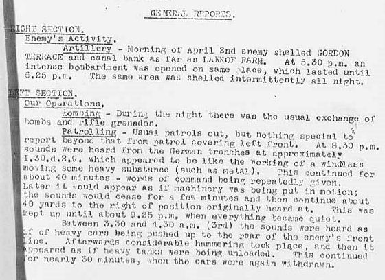{width="12.252cm"
height="8.925cm"}

Hill 60, located about three miles south-east of Ypres, was made from
the soil removed during the construction of the nearby railway line.
Because it was a small area of elevated land in a very flat landscape,
it had singular strategic importance in the battles in the salient, and
had been coveted and won and lost by both sides over the course of the
war. In April, 1916, Hill 60 belonged to the Germans, and the 5^th^
battalion, including Wilfrid, were occupying trenches directly across
from it.

Reading the brigade diary shows how unrelenting the war was. If you were
in the trenches, you were on perpetual high alert. Quiet days of
drilling and inspections were interspersed with days like March 16/16:

Enemy's artillery very active between 1 and 3 p.m. Throwing 732 5.9" and
8.2" shells around our defences. Germans threw over 1200 shells in our
brigade area.

Or April 2/16:

Day quiet on our front but active on our flanks at Hill 60 and the
Bluff. Built new cemetery.

Much of the activity is related to German artillery barrages, most of
which can be "quieted" by a commensurate response, but German snipers
also make pretty regular appearances in the diary entries. In fact, the
5^th^ battalion commander notes that on April 17^th^, only one day after
relieving the 10^th^, the "enemy's snipers were busy." They had picked
off seven men in trenches 38-44, six of whom were wounded and one
killed. The next day four more were wounded.

As the month wore on, sniper activity diminished as the fifth's trenches
became the target of near daily German artillery barrages. From April
19^th^ onward, bombardments were reported regularly, increasing in
accuracy and intensity with each passing day.

Troop Rotation

The Canadian military knew no-one could stay in the front-line trenches
for more than a few days without risking full mental collapse. Even when
no over-the-top offensive was in their future (and that appears to have
been a rare occurrence), the men were in a state of near-constant
stress. The risk of death or dismemberment from enemy bombardment and
sniper attacks was real and always present. Even on days when no heavy
bombardment by the enemy occurred, the battalion diary contains a record
of at least 1 -- 4 privates losing their lives on a daily basis.

So, a rotation system was introduced to provide frequent and extended
breaks from the front, a "tour" of duty that entailed 5-6 days at the
front, followed by the same number of days in support trenches, 200 to
400 yards in the rear, then to reserve billets, 800 -- 1,000 yards from
the front (where troops were typically deloused -- very temporarily -
and bathed), and finally to billets (typically in barns) in a
half-ruined village four or five miles back.

Many of Wilfrid's letters were written while he was in the near or far
rear of the action. While reading the letters, I'd noticed that many of
them were written on relatively large pages (about 8.5 x 11
for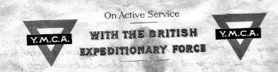{width="12.568cm"
height="3.281cm"}mat) with a YMCA logo at the top:

These letters were written when Wilfrid was situated in a reserve billet
that included the very popular YMCA hut. These huts were set up to
provide some level of comfort, refreshment and companionship to men that
might otherwise turn to gambling or other shocking, non-Christian
pursuits. These and the Salvation Army huts provided free coffee and tea
(and apparently writing paper, too), and they sold candy, favorite food
items and tobacco. One trench soldier said, "We would have been utterly
lost without it, although we grumbled at the terrifically high prices we
had to pay." (Cook, 393).

Wilfred's First Experience of Shell Shock

But then on April 24^th^, what started as just another quiet day in the
trenches was transformed into an afternoon of death and living burial
for men of the fifth. The Germans launched a non-stop four-hour barrage
of heavy artillery on the trenches 38-44, which happened to be situated
directly across from Hill 60.

Although his letters are sparse to non-existent from mid-March until
later in April, we can piece together a lot from the letter sent by his
commanding officer (Lieughtenant M.S. Hunt), Fifth Battalion and 1^st^
Division War diary entries.

The 1^st^ Division diary is the driest of the these documents, reporting
that 275 Canadian shells were no match for the 900 German shells that
were blasted into Canadian trenches, most of it focused on the
mid-section (5^th^ battalion location). The shell metrics for a heavy
bombardment are around 400 -450 enemy shells, so this bombardment was
"intense" by any measure.

The Fifth battalion diary for April 24^th^ was relatively detailed and
described a bombardment unprecedented in intensity that lasted for four
hours:

Enemy started a most intense bombardment on our front commencing about 2
p.m. and kept it up till 6 pm. -- utterly wiping out our front line. He
used all calibre guns and trench mortars. Our own artillery replied most
effectively absolutely demolishing his trench system on Hill 60. After
the bombardment had finished one of the enemy was noticed waving a white
flag from the remnants of the trenches. Whole trenches \[Canadian
trenches -- ed.\] were completely blown in and when the bombardment
ceased our men were just holding small holes here and there. The morale
of the men was excellent throughout it all. The Battalion was relieved
by the second battalion, the relief not being complete until 4 a.m.

The war diary of the Second Battalion stated: In evening relieved the
5^th^ Battalion in trenches 38-44 inclusive. 5^th^ had been badly
shelled and trenches were in very bad condition.

The First Division Artillery Report gives a more detailed account of the
24^th^:

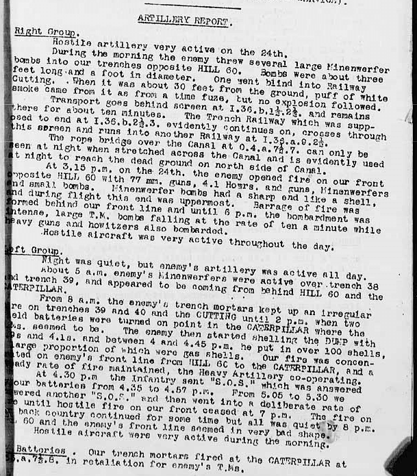{width="16.113cm"
height="18.389cm"}

Alexander Dunlop received a letter from Wilfrid's commanding officer,
M.S. Hunt, written in the early hours of April 25^th^, likely
immediately after the 5^th^ had been relieved by the 2^nd^ Battalion.
Hunt first assures the family that "he will be O.K." He explained that
Wilfrid "stood bravely to his task under the most awful concentrated
enemy artillery bombardment since the beginning of the war, and he with
many more of us was buried more than once by the effects of high
explosive shells." And he "came out without wounds excepts from strain
and shock,,,and will be OK After a bit of rest in the hospital."

"Our trenches were only from 30 to 80 yards from each other. The Bosh
opened on us with all kinds of dope and kept it up for five hours. Then
thinking we were completely demoralized shut off their artillery and
came up to their own front lines to for up for a charge our our
trenches, but they finding the 5^th^ ready and anxious to have them come
over hesitated. One fellow, who could speak English very well called out
to us, asking us if we were "all dead" or "ready to give up." A hundred
Canadian voices answered thuswise, "Come on over you S. of B-s!" but
they did not come and then our own artillery gave them H\--. Worse than
they gave us and after it was over we could plainly hear the groans and
cried of the wounded Bosh. We were relieved at 2 a.m. and this if the
first rest I have had for 48 hours. Thus ends another chapter in the
history of Hill 60."

Hunt was from Neepawa himself, and it's clear that the Neepawa men
looked after each other and took it upon themselves to keep Neepawa
families informed. Only a Neepawa-born-and bred commanding officer would
have taken the time to write a detailed letter of comfort to a family
within an hour of the wounded man's removal to a field hospital
\--especially having gone without sleep for 48 hours.

George Fairbairn Writes to Nellie Dunlop from the Trench Dressing
Station

Another Neepawa boy (George Fairbairn) in the 5^th^ battalion wrote a
very kind letter to Nellie dated May 4th. He had been put in charge of
the Trench Dressing station, so could give her a first-hand account of
her son's condition, and was obliging Wilfrid who had asked him to
write.

As it happened, by May 4^th^, Wilfrid's condition was very poor indeed.
He had gone back to the trenches far too soon. Hunt had suggested that
Wilfred would be spending several weeks in the hospital, but Wilfrid
refused to stay any longer than six days (from April 24-30). As George
reported, six days was not enough for "severe shell shock" but Wilfrid
was "in a big hurry to get back" even though George thought "he wasn't
looking any too well" and had a high temperature to boot. His medical
records indicate he was suffering from "gastro-enteritis" but in
George's opinion "he needs a good rest after such a shock."

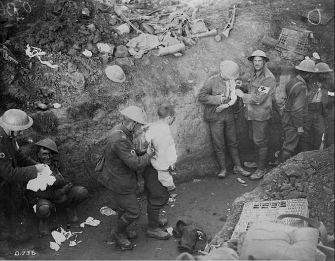{width="13.944cm"
height="9.705cm"}Field Dressing Station at the Battle of Courcelette

An interesting side note about George Fairbairn: He signed up in the
summer of 1915 and sailed over in The Corsican in September of that
year, just like Wilfrid. His occupation was listed as "druggist" and he
became a Sargeant in charge of the 5^th^ battalion field dressing
station, which was the first place a wounded soldier arrived at -- if he
was lucky enough to get there. The field dressing stations were rough
places, really not much more than trenches with wound dressing
materials, in which the soldiers were triaged according to the severity
of their wounds.

George was a lively and dutiful writer of letters to the Neepawa
families of the Neepawa wounded. He wrote two in total to Nellie Dunlop,
this first one when Wilfrid suffered from terrible shell shock, and then
later when he was wounded at Courcelette.

I checked on George's fate, and found he survived the war, returning to
Canada in September of 1919, but he was wounded three times: a minor
wound in November of 1917, and then in 1918 he was gassed twice,
suffering first with burns to his face and then burns to his eyes --
but, despite that, he never left the battlefield from his arrival in
Belgium in early 1916 to the end of the war. He was promoted to Lance
Corporal, then to Sargeant, and finally, he received the Meritorious
Service Medal in recognition of valuable services rendered in France and
Belgium in 1919. After being gassed for the third time -- and recovering
-- he was awarded the most-wanted award that all Canadian soldiers
desired the most -- 14 days paid leave to Paris in early 1918.

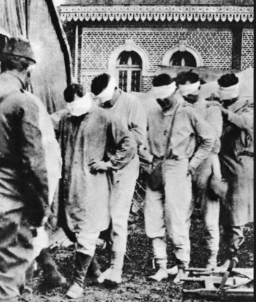{width="11.086cm"
height="13.097cm"}

Like Wilfrid, George died as a civilian at a relatively young age. His
army records were "updated" at one point with a carelessly scrawled note
in red pencil that states: **Deceased 20-7-46**. Born in 1882, that puts
his end of life at age 54. Wilfrid died in '41 at the age of 48, so they
both shared a lifespan that was cut off in middle age. One suspects
their war experiences had more than a little to do with their early
deaths, but we can never be sure.

**Wilfrid's Description of the Bombardment**\

It was more than just a major bombardment; it was a nightmare scenario
of six days without sleep in muddy, wet, filthy, ill-equipped trenches:

This bunch of trenches we were occupying had no sleeping accommodations
at all and were very wet so most of the boys had bearly (sic) any sleep
for over six days and were in no condition to face such a bombardment.
Believe me when one of those nice big shells lands quiet (sic) close to
you the explosion sure jars ones nerves. The ground fairly rocking like
an earthquake\...and old Fritz was throwing them at us by the hundreds.

Evidently, the 5^th^ occupied these same trenches opposite Hill 60
(which must've been somewhat less than demolished as reported by the
5^th^ commander) right up until the time they left for the Somme in
September.

Wilfrid was finally well enough to write to his mother on May 10^th^.
While he was still in hospital from with gastro-enteritis induced by the
shock and, no doubt, contaminated food, he was scheduled to return to
the trenches immanently. He was anxious to reassure his mother that he
"was lucky; mighty lucky." He goes on to say that the four-hour
bombardment was "a regular hell\...the air fairly shrieked with shrapnel
and high explosive shells. I was badly shaken and was vomiting for
nearly two days afterwards."

Unfortunately, half of the second page of that letter is missing, and
the top half was badly damaged, so it scanned poorly. Here is the text
of the top half, as best I can decipher it:

However, I am quite well again and only hope that I never get anything
worse. All that I owned was buried.

He wrote his sister, May, on that same day (May 10) he wrote to his
mother. In that letter (as was often the case) his writing was much more
direct and frank about his experience of being "buried up." It had been
over two weeks since the bombardment but had not been able to write
until that day: "I have been feeling so rotten lately that I simply
could not settle myself down to writing letters\...It was the worst
experience of my life and I never want to see anything like it again so
long as I live."

The Battle of Mount Sorrel

But there was worse to come. Wilfrid returned to his battalion, and was
almost immediately cast into the hell of an exceptionally brutal six-day
bombardment.

Wilfrid's return from the field hospital on May 18^th^ was unfortunately
timed. His battalion had only just returned to the same old front-line
trenches of the Ypres salient around Hill 60, where they were being
subjected to both daily and nightly shelling as the German's started
gearing up for the all-out pounding of the Battle of Mount Sorrel (June
2 -- 13). The German's strategy behind the offensive was twofold: to
regain some of strategically important high-ground of the salient that
had been previously lost, and to draw troops away from the allied troop
build up known to be happening on the Somme -- and to keep them pinned
down. They planned an all-out assault by the Royal Wurttemberg Corps to
attack the peaks of Mount Sorrel, Hill 62 and Hill 61.

Of course, "peak" is a relative term. Like most of Belgium, the area
around Ypres is very flat, so occupying any degree of higher ground
provides a huge observational and strategic advantage. Mount Sorrel is,
in fact, only 30 metres high.

Conditions were cold and wet from unseasonably rainy weather and the
trenches were clogged with mud. At 8:30 a.m. on June 2^nd^, the first
day of the Mount Sorrel offensive, what has been described as a "one of
the most staggering bombardments of the war", a "hurricane of enemy
fire" concentrated on the Canadian trenches was unleashed. Many of those
impossibly muddy trenches and the men who had stood in them, vanished
under a sea of freshly churned earth. The Wikipedia entry for the Battle
of Mount Sorrel states: "On the morning of 2 June, the German Corps
began a massive heavy artillery bombardment against the Canadian
positions. Nine-tenths of the Canadian forward battalion became
casualties during the bombardment."

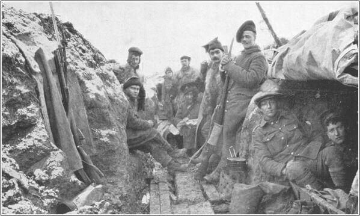{width="15.849cm"
height="9.499cm"}

*Canadian Trench at the Battle of Mount Sorrel *

The horrific level of shelling was sustained until 1 p.m., but there was
to be no real respite. Four mines were detonated below the Canadian
lines, projecting more mud and human remains into the air as remaining
trenches collapsed.

As one officer described it in a letter home, "It seemed as thought the
line had been transformed into an active volcano, so continuous were the
flashes of bursting shells." The divisional commander was decapitated,
and very few survived, but Wilfrid's luck held.

The devastating mine explosions were quickly followed by an attack by
six Wurttemberg assault battalions. The 5^th^ was stationed on the
southern edge of the front line very near Mount Sorrel, so, as you can
see from the map below, they were not in direct line of fire from the
attacking Wurttemberg corps, and likely escaped the worst of the
fighting.

However, the 5^th^ was cited for their valour in defending their
shattered trenches, and, although they failed to stop the attack, they
made it a costly one for the Germans. Sargeant John Caw of the 5^th^
wrote: " We had him (the Germans) where we wanted him; halfway up a
slope, no cover, and digging himself in, in full view in broad daylight,
range about six hundred yards."

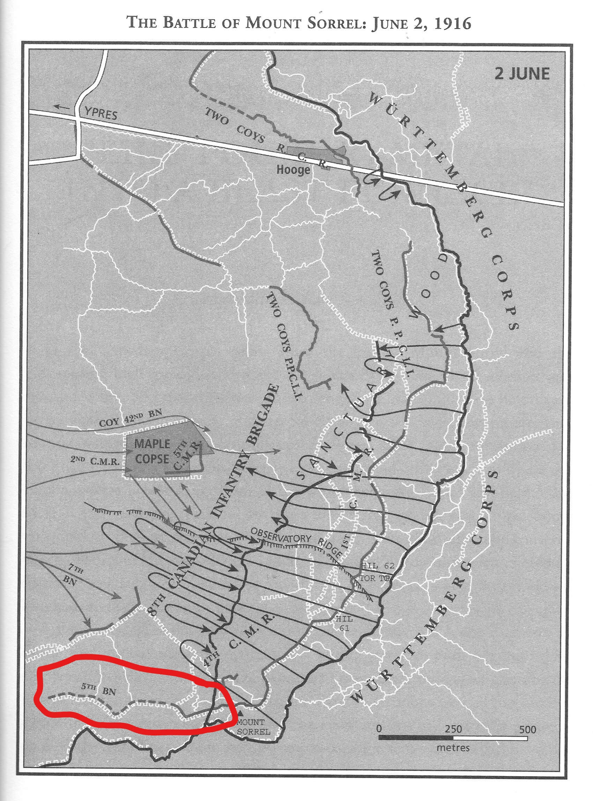{width="17.59cm"
height="23.768cm"}

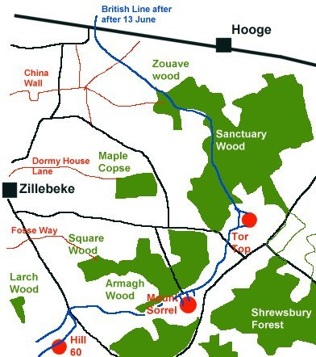{width="6.246cm"
height="7.043cm"}

This first day of the Mount Sorrel offensive was a major failure for the
Canadians. The Germans successfully overran 1,000 metres of trenches and
captured the heights of Mount Sorrel, Hill 61 and Hill 62 as well as the
village of Hooge. A counter-attack mounted the next day failed, and
three days later, the Germans exploded four more mines directly under
the Canadians. The map on the right shows the amount of ground the
Germans took from the combined British and Canadian forces at Mt.
Sorrel.

However, on June 13^th^ (the fifth had been relieved from front-line
duty by this date) the Canadians drove back the Germans and recaptured
much of the lost ground.

As a result of the June 13th assault, in which the Canadians (including
Richard Buckley's 3^rd^ division) had gone "over the top" to attack the
German positions in Hill 60, 61, 62 and Mount Sorrel, retaking all the
high ground that had been lost on June 2. Fierce hand-to-hand and
bayonet fighting were the order of the day and the result was pure
carnage. To those who fought in this attack, the remainder of the war
"was an anti-climax" merely. The total casualties for the two weeks of
fighting was 8,700 men. As Tim Cook comments in *At the Sharp End,*
Mount Sorrel raised the curtain on a new level of ferocity and intensity
in the war. The German bombardment had been an unprecedented experience
for the Canadians, with almost entire battalions shattered by
shellfire."

The 5^th^ battalion war diary for the first days of June record daily
heavy and intense bombardments on the Hill 60 trenches that lasted the
entire day and into the evening. By the end of the first six days in
June, 60 men in Wilfrid's battalion had lost their lives, while 181 were
either wounded or missing. We noted that Lt. M.S. Hunt from Neepawa, who
had written the kind if understandably weary letter to Wilfrid's father
immediately after Wilfred had experienced being "buried up" was among
the wounded.

June 6^th\ was\ ^the last full day for the 5^th^ battalion on the front
lines, and it was also one of the worst. Here's the 5^th^ battalion war
diary for that day:

At 9 a.m. the enemy opened up our Front Line with trench mortars and at
12:30 p.m. their artillery opened on our Front Line. The bombardment
lasted until 4:30 p.m. by which time the trenches from 40 to 43 were
practically destroyed. They opened up another bombardment at 5:35 p.m.
Our artillery retaliated on the enemy Front and Support Lines. The
Battalion was relieved at about midnight by the 10^th^ Battalion and
proceed to Camp D.

On June 7^th^, the battalion commander summarized the total casualties
for the last six days: 60 killed; wounded and missing 181.

On June 11, Wilfrid describes the bombardment to his mother, saying that
he "got back to the battalion just in time to go through a bombardment,
which was, by far, more fierce and more lengthy than the last..lasting
six days. It was worse than "forty Hells" for us. I was knocked about
more in the last bombardment than in the first, but I was either in
better condition or more accustomed to it, for I came out of it none the
worse for my experiences. One big 8 inch shell hit right in front of the
cover I was under and the concussion knocked me senseless for nearly an
hour. Ye gods! I thought the world had come to an end but within an hour
or so I was feeling as good as ever. I never want to be that near to a
shell again."

On the 9^th^ of June, the battalion war diary mentions that battalion
will undergo a reorganization: Some men were charged with providing
support for the Canadian troops involved in the June Affair (the Mount
Sorrel offensive), carrying in wounded that were transported by railway
to field hospitals, while others were relegated to carry supplies and
others to bury the Canadian dead. Wilfrid's letters from this period do
not mention bombardments at all, although he could not clearly indicate
what he was doing. He was grateful to be out of the front-line trenches
for any period of time, but his letters from this period are very short
and unemotional.

A Note on Wilfrid's Letters

Wilfrid wrote a lot of letters during his four-year war experience. Some
of them are much, much better than others, but he wrote dutifully to
both his mother and his oldest sister at least once or twice a week
throughout those years. Some of the letters are a little whiney,
especially when he's begging for cash, which he always seems to be
doing. But, you can't really blame him too much. The military gave its
solders almost nothing to live on, and he was also doing his darndest to
pay off his debts to Mr. Glass via his sister May by assigning half of
his pay to her for that purpose. It must've been quite a big debt,
though. Even by the end of 1916, it had yet to be paid off in full,
after 18 months of paying it down.

It's really amazing to think that the letters he wrote were not just to
his mother and sister. The reading audience for the letters now includes
his sons (at least, Bill Dunlop, we know read all of them, and kept them
safely in storage for his enter life), and now by his granddaughters,
his adopted grandson, Billy, and all his great grandchildren, too.

In the majority of his letters to his mother, Wilfrid always ends his
letter with an up-beat "Love to all, including Paucha." Paucha was the
family dog, and he was also jocularly referred to as "it", "the brown
fool", "the hound", "Tiny", etc.).

In December, 1917, he tells May that he "received the Xmas card from
Tiny which I keep on my desk. Several of the Nursing Sisters have asked
who Tiny is. They think it is a girl so I just let them think on. Poor
Paucha, little does he know how he is being talked about!"

If there's a gene that governs a love for animals, Wilfrid must be one
familial source. Just as Leona Newton would be as well, with her well
known deep and devoted love of dogs, so it's really no wonder we're all
hopelessly besotted with dogs, cats, birds, turtles, guinea pigs, etc.,
etc.. And, if there's a gene that governs a love for creating
amusing/teasing nicknames, maybe we can trace the origin of that gene
back to Wilfrid as well.

Wilfrid could be charming, sometimes in his letters. However, you can't
help but notice a coarsening -- and even a reduction \-- of feeling in
the letters from May to August. This must be due to his grim day-to-day
experiences seeing his friends and fellow soldiers picked off by daily
bombardments and snipers' bullets. Also, the stress of this experience
would not have been conducive to writing long, leisurely letters home.
His letters do indeed become increasingly formulaic and shorter. As the
weeks of trench living in Ypres grind on, his letters become predictable
and not very interesting records of packages requested and arrived,
expressions of gratitude for their contents, pining for his return to
"good old Neepawa" and the casting of aspersions on those individual
Neepawa cowards (Freddie Kerr, in particular) who failed in their duty
to the empire by refusing to enlist. This may seem at odds with his very
passionately held stance opposing conscription, but I think he did
firmly believe no-one should be forced to serve, but anyone with an
ounce of backbone ought to do voluntarily.

On at least three or four occasions while he is in Belgium and France,
he makes contemptuous remarks about men who had not joined the military.
For example: "It is amusing to hear about Freddie Kerr. The best thing
in the world that could ever happen to him would be to come out here for
a few months....Of course, that would be a rather rude awakening for
poor Freddie." (July 10, 1916) Such remarks become increasingly evident
in the letters, but he may have been egged on by his mother: "Your
remarks about "Percy Kerr" \[likely a derogatory name for "poor
Freddie"\] with his white flannels on were very amusing, but at the same
time, someone should have him "pinched" as a deserter." (August 5, 1916)
Even after he was wounded, he kept up his verbal vendetta against young
"Percy" (see his letter of October 29, 1916 -- in which he says "the war
will last another 18 months at least, so Percy Kerr need not worry about
whether he will get to France -- he *will* get there and let's hope it
happen quick."

This sneering contempt for those who stayed at home and even for those
in other battalions was apparently becoming endemic among the Canadian
ranks -- coming to a head in the Mount Sorrel conflict. \[At the Sharp
End, p.

Maybe it was the prospect of censorship that prevented him from saying
much of interest, but many of Wilfrid's active-service letters become
little more than begging for more treats from home.

Here's a very typical out-take:

"I have not had a parcel from home for some weeks now. I wish the hot
weather would let up over there for a few days as I certainly would like
some more home-made cake etc. and etc. If you have any homemade jam or
preserves that you do not want, don't forget I have a great
appetite?????"

In one letter he'll tell his mother that his sister Ruby is sending him
cigarettes, and won't they be highly prized when they arrive. In the
next letter to his mother, he'll complain those cigarettes still haven't
come, and continue to complain with each succeeding letter until they
arrive.

While he was in active service, Wilfrid begged not for cash but for
goodies (including smokes). After he was wounded, the hounding for money
starts all over again -- sometimes it's overt, but it's mostly a kind of
disingenuously wheedling for cash. From the hospital, he writes: "I
wrote to May the other day and will try and raise a penny stamp to write
to Ruby\...we have to pay our own postage now you know."

By way of contrast, it's interesting to note that Richard Buckley's
letters are full of gratitude just for any letters received. But more on
Richard Buckley later.

Also, when describing an incident Wilfrid would tell his mother one
thing and his sister quite another -- which is not at all surprising.
For instance, on October 17, 1916, in the early days of his
convalescence, he told his mother, "On Sunday afternoon I was out to tea
with some very nice people." Four days later, he wrote to his sister May
about the very same afternoon: "The people around this city are dandy. I
was out to tea last Sunday with with seven very nice people to a little
party. We had an elegant time. All afternoon we played billiards and
then sat down to a square meal. I wont the snooker pool contest so I was
entitled the lion's share of everything at the tea table, and, believe
me, I did not leave anything.. Am going out again next Sunday. This is
sure a great life. Beats France all to bits."

Final Days In and Out of the Trenches of Ypres

The battalion returned to the front lines on June 20, where they
relieved two battalions in the railway dugouts and zillebeke switch.
Here they were involved in work parties and salvage work, as well as
carrying out the wounded from the Mount Sorrel slaughter. This work in
itself was not risk-free, as on a single day, 21 men were wounded in the
course of these work parties.

This period of behind-the-scenes work came to an end on June 30^th^,
when the battalion relieved the 15^th^ battalion and returned to the
same front line trenches (39-45), opposite Hill 60. Luckily for them,
however, the major assaults of both sides that occurred mid-June were
well in the past, but the fighting around Hill 60 didn't completely end.
As Wilfrid pointed out in a letter to his sister in early August (just
before his Division was transported to the Somme): "I came through the
June mix-ups alright and also the July ones, and am just as good as
ever, if not better."

Wilfrid's references to the July "mix-up" didn't tell the whole story,
as July was significantly quieter and more peaceful on the front lines
than June was. When the 5^th^ returned to Hill 60 front line trenches at
the end of June, great offensive shelling on the part of the Canadians,
with far fewer casualties and deaths were recorded. A typical diary
entry notied very active shelling into the German trenches, with the
"enemy batteries retaliating only weakly". The six-days in the front
line came to an end without significant enemy bombardment.

The battalion spent the next two weeks back at the Scottish lines and
then in the Corps Reserve Camp, not returning to Hill 60 until July
20^th^. Desultory back-and-forth shelling followed with minimal
casualties and rare deaths. They returned to the Scottish Lines in the
rear on the 26^th^ of July for rest, recuperation and squad drills and
parades.They got to use the Division Baths and played baseball against
other ballations. Significantly, the battalion also participated in
practice route marches at this time, in preparation for moving the
entire Division 1 to the Somme area. The battalion would only return
once more to the front-line trenches in Belgium and the much reduced
enemy contingent (most of them had already been sent to the Somme area)
made it a very quiet sojourn. Their next task was to make the 126
kilometre journey from Ypres to Albert, France to join the fighting at
the Somme, which had been underway since July, with disastrous effect.

Richard Buckley: Surrogate Dunlop Son

Wilfrid's best friend was Richard Buckley (1893 - ?). An Irish
immigrant, Richard joined up at the same time as Wilfrid (August 9,
1915) in Winnipeg, They were at the same training camp and even were
lucky enough to share a room in the transport ship that took them to
Shorncliffe, England to continue their training. At Mount Sorrel, he was
not quite as lucky Wilfrid, whose battalion played more of a supporting
role throughout the worst of the Mt. Sorrel battles. Although he
survived, his 7^th^ brigade of Canada's 3^rd^ division, was in the very
thick of the action in what was known as "the June show" or the "June
affair".

Richard wrote fairly often to Mrs. Dunlop, who appears to have treated
him like a son, writing him frequent letters, sending him parcels and
even knitting him socks. His letter of July 4^th^ is especially vivid in
his description of the fighting during the Canadians' Mount Sorrel
disaster, a disaster in that it garnered nearly 9,000 casualties in the
first two weeks of the month alone -- and, like so many Great War
battles, trench real estate would be lost and then recovered, and, in
the end, the result was almost zero net change to the ground held by
either side.

Richard Buckley's letters were different from Wilfrid's. While Wilfrid
seems reluctant to describe either the daily grind or the horrors of
battle (although, with the censor potentially reading every letter, this
kind of thing of discouraged), Richard writes with a richness of detail
and emotional color that is absent from Wilfrid's letters. For instance,
in a letter dated May 26, 1916, Richard describes where he is as he
writes the letter: "I am writing this letter in a little dug-out not
very far from Mr Fritz, but I expect to be much closer to the beggar
before the week is out. I have been getting along very well since I came
up here, and by degrees am getting used to this hide-and-seek trench
war. Just now, a few shells are flying overhead, and the big ones go
through the air making a noise somewhat similar to a street car, and
they sound just as big, and move so slow, too."

Richard's letters are very powerful, with a rawness of emotion and
sentiment you don't find in Wilfred's. When reading them you sense that
witnessing the daily deaths and maimings of his fellow soldiers created
depths of feeling that were freely mined in his letters to Mrs. Dunlop,
to whom he clearly felt very close. In the letter of July 4, 1916, he is
especially emotional. Wilfrid never mentions death or the immanence of
it. Richard is not afraid to talk about it. He writes about meeting up
with other Neepawa boys: "I may say we were all very glad to see each
other. I suppose it was because we had seen a little more fighting than
usual, and we wondered who had been lucky enough to get through it."

He writes very frankly about "the June affair" as the Battle of Mount
Sorrel was called at the time: I ran across Andy Mitchell. He had just
come out of the June affair, and like the rest of us, he felt pleased to
be back where we were just then. What we saw during those five days was
more than enough to show me at last how very terrible war is, and I
surely did see in that time things which at ordinary times we could not
bear, but unfortunately they are all too common sights which come as a
matter of course." Richard goes on to describe a particularly affecting
death of a young man in his company: "The other day one of our boys was
badly hit, and almost his last words were "Well, boys, I'm done. Carry
on the good work, and God will give you victory....He died inside two
day, though we did our best for him and took him to the station \[field
hospital or wound-dressing station\] in broad daylight. It is hard to
see such good fellows go under\..."

He opened up to Wilfrid's mother in a way that Wilfrid himself seemed
unable -- or unwilling -- to do. He was especially affected by the
warmth and friendliness of the people of Neepawa, who accepted him so
gladly and were "the kindest and most sincere friends that one could
ever have\...treated by all just as though I have lived my life there,
and this I cannot forget. I am sure that at times you must have
considered me very odd\...which I attribute to an affliction which has
often worried me beyond everything, and that is, as you know, a stammer
caused by nervousness. Indeed, I felt very thankful to you all who made
things so much like home to me that made lose this nervous feeling all
the time I was there..To your family I owe more than I can repay, and
certainly you have treated me not as a friend only, but almost as though
I was one of your own." The sombre fluency of these letters is stunning.
You sense that Richard clearly understood how strongly blind luck was
involved in surviving the awful mechanized terror of the war, and how
much he needed to communicate his gratitude and love to the world he
might be very soon leaving behind.

Richard was born in on the 12^th^ of September, 1893 in Eniskerry,
County Wicklow, Ireland, leaving on his own to settle in Neepawa at the
age of 20. His family remained behind in Ireland, and his father,
Francis Buckley, a farmer and hotel proprietor still living in
Eniskerry, was listed as his next of kin in his military will. Like
Wilfrid, Richard was a bank clerk, just like Wilfrid, working at the
Neepawa Imperial Bank of Commerce. He was about five years older than
Wilfrid and comes across as much more mature and thoughtful in his
letters. He also has the Irish gift of the gab, and writes in a
loquacious and colorful way about his day-to-day life when he'd been
relieved from the front-line trenches. Writing about the details of
trench warfare was a definite no-no that would never be approved by the
censors who read every letter.

Richard was among those very lucky individuals who served for the entire
duration of the war without being either seriously injured or killed. He
served in Belgium and France with the 7^th^ Brigade (3rd Division) --the
famous "fighting seventh" as they were called \-- from April 1, 1916
until the very end of the war without once receiving an injury. I
suspect his ability to survive the war had more than a little to do with
the fact that he chose to become a machine gunner. Machine gunners
always had one of the most fearsome weapons of the war between
themselves and their enemies, unlike the poor infantryman with only a
helmet and a single-action rifle to protect themselves.

The Seventh Brigade included Princess Patricia\'s Canadian Light
Infantry (PPCLI), a well-known and highly seasoned group of elite war
vets who had fought with the British in the Boer War, the Royal Canadian
Regiment, the 42nd Battalion from Montreal and the 49th Battalion from
Edmonton. Richard was a member of the 7^th^ Brigade Machine Gun Company,
which could be attached to any of the four battalions and regiments that
made up the 7^th^ Brigade.

The 3^rd^ Division occupied a large portion of the Ypres salient (from
the village of Hooge to Santuary Wood and down through Hill 62, 61,
Mount Sorrel)during the Battle of Mount Sorrel, and Wilfred's 5^th^
Battalion occupied neighboring trenches just below Mount Sorrel,
directly across from Hill 60. Richard's third division was on the
receiving end of the very worst of the German offensive during the
Battle of Mount Sorrel. During an especially horrific assault that
obliterated trenches and nearly wiped out the entire light infantry
group -- more than 400 men of the PPCLI were killed on one day during
the height of the assaults in early June, 1916.

Another WW1 Horror: Trench Fever

While Richard managed to escape shrapnel and bullets, he contracted a
case of trench fever that was serious enough to require hospitalization
had to be sent to England twice to recover. The first hospitalization
occur in October of 1916 just after the Courcelette offensive, and his
medical records show this was the first of several hospitalizations for
the condition.

Trench fever is fairly serious disease caused by a bacteria called
Bartonella Quintana, which is found in the stomach walls of body lice.
It's interesting to note that the human body louse doesn't actually live
on the body, rather it takes up its insidious residence in a person's
clothing -- and, for some odd reason, in the seams of clothing. While it
doesn't live on the skin, it does feed on human blood, and causes severe
itching as a result. Scratching the itch can cause the feces of the
louse, which contain the nasty bacteria named above, to be released into
the bloodstream and so spread the infection.

It causes high fever, severe headache, pain on moving the eyes, skin
rash, dizziness, constant severe pain in the shins, and sore muscles,
particularly affecting the shins. This all sounds bad enough, but what
makes it even worse is the recurrence of the fever (along with the other
symptoms) which could rise and then break after a week, cycling through
as frequently as eight times before disappearing. Recovery was slow,
often requiring several months rest. This is why Richard experienced so
many and such prolonged periods of hospitalization. And it often didn't
stop there. It could be experienced in relapse as many as ten years
after the initial infection, and cause heart problems.

 It was pretty much endemic, given the prevalence of lice embedded in
almost every combatant's clothing and the squalor, filth and cramped
conditions of trench life. It's possible that as many as 30% of WW1
soldiers suffered from this condition in some degree. His final medical
record in 1919 states that Richard continued to feel severe pain in his
legs even at the time of his discharge.

Although you might think no-one could envy an individual struck down by
a chronic disease, it did allow him to escape the carnage of Vimy Ridge,
Passchendale, and Hill 70, which decimated his 3^rd^ Division in 1917
and '18. No doubt his continuing bouts of Trench Fever were responsible
for him being invalided to England in November of 1916, where he
remained, safely sidelined for the remainder of the war. He was assigned
to the Canadian Machine Gun Depot, at training school for the Machine
Gun companies, first at the Crowborough barracks and then at
Riseborough, where he was most likely involved in teaching new troops
machine-gun use in these pleasant seaside towns.

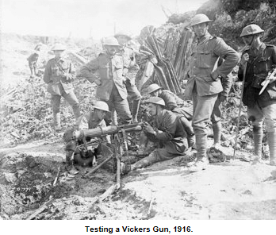{width="9.208cm"
height="7.832cm"}

Richard was honorably discharged on June 24^th^, 1919, returning to his
bank clerk position at C\
IBC in neepawa on July 4^th^ of that year. During the war, his
leadership qualities were recognized, as he was promoted first to
Corporal and then to the rank of Sargaent.

Wilfrid was also promoted to Sargaent (Richard B.'s letter of Sept. 20:
"I noticed he had a stripe up and had to congratulate him upon his
promotion. You see, he will now be a leader of men." But, for reasons
that will become clear as this narrative progresses, he lost his
commission while he was serving as a military clerk in England.\

The Somme

Wilfrid and Richard arrived at the Somme battlefield (Albert, France) to
a front-line experience of much greater intensity and ferocity than
Ypres. As it happened, the more relaxed nature of the front-line
experience at Ypres post-Mt. Sorrel action was almost wholly a result of
the Germans having deployed most of their experienced, and feirce,
troops to the Somme.

The preceding two years had been marked by defeat for the entente
troops, and an especially egregious waste of French, British, Canadian
and Australian lives. As Tim Cook crisply remarked, "the entente needed
a victory." (Cook, 405) With a promise of concerted, coordinated
offensive efforts by all parties of the entente to break through the
stalemated trench situation, the Somme was to be the largest British
offensive to that point in history. (Cook, 406).

Of course, nobody thinks of victory when the Somme battles are
mentioned. Much has been written about the first day of the battle of
the Somme on July 1, 2016. By the end of that day, of 120,000 British
soldiers involved in the day-long attack, more than 19,000 died and
38,000 were wounded. That first day came to represent the futility and
waste of the war, and the grotesque incompetence of the generals who
were its strategists.

But what happened next? Somme area activity appears to have devolved
into the identical trench-based stalemate of mutual bombardment,
punctuated by occasional skirmishes into the hell of no-mans'-land we've
seen with the Canadian experience in Ypres -- except with much greater
artillery power. The intent from July 1 to September 14^th^ was the same
as the intent at Ypres: to simply wear down the enemy and straighten out
trench lines by gaining a few feet here and there. That hardly
constitutes a strategy, but it served as the template for the actions
that pervade this most wearying of wars. As Tim Cook states: "The
battles of Poziers, Longueval, Delville Wood and Guillement" -- all
fought during these two months -- "left thousands of dead, and for
little gain."

By the time the Canadians arrived at the Somme in early September, two
months of fighting by the British and French had resulted in the gain of
only 8 kilometres from the enemy, at the cost of *another* 100,000
casualties \-- and more troops were desperately needed.

The Somme had become synonymous with death and maining on an
industrial-scale, and you can bet the Dominion soldiers had a pretty
fair idea of what kind of slaughterhouse they were marching into. The
Canadian Corps had suffered 9,000 casualties at Mount Sorrel, but this
number was about to become negligable.

The Somme battlefield was a nightmare landscape. As Tim Cook describes
it, "It ws a wasteland of ruined farmers' fields; scummy, water-filled
shell holes; and acres of unburied corpses\...a mixture of blackened
flesh and broken bounds with thousands of tonnes of metal and shattered
structures."

Canadian 2^nd^ Brigade Arrival in Albert

The BEF commander, Field Marshal Haig wanted the newly arrived Canadians
to have a two-week opportunity to become acclimatized with the area
prior to the first major Canadian offensive, scheduled for September
15th. It was a tall order to move the entire Canadian Corps from Ypres
to the Somme, but it was apparently done like clockwork. The Division
1/Second Brigade diaries record a meticulously well-worked out plan that
got all battalions, brigades and companies across the 140 mile with
minimal problems and minimal stress to the troops.

Wilfrid's journey to the Somme started in late August. On August 22, the
battalion war diary states that the men "paraded at 2:45 a.m. and
marched 32 miles to Arques, France, where the men entrained and
proceeded by rail to Candas, France. From there, the battalion marched 3
miles to billets at Fieffes, and then on to the Brickfields area near
Albert."

The entire 1^st^ Division left Ypres at this time, leaving the 3^rd^
Division, including Richard Buckley, behind to maintain the front line
for another week. He was to follow fairly soon after as his division
made the same journey to the Somme area (Albert, France). As Richard
said in his letter of September 20, "We were glad to meet again, and
have been together for an hour or two." Wilfrid had already been through
some major fighting at this point.

On arrival at their destination in France, the thousands of entente
troops were stationed in an area called the Brickfields, just outside of
Albert. The Brickfields was a sea of tents, but apparently there were
insufficient tents for the Canadians.

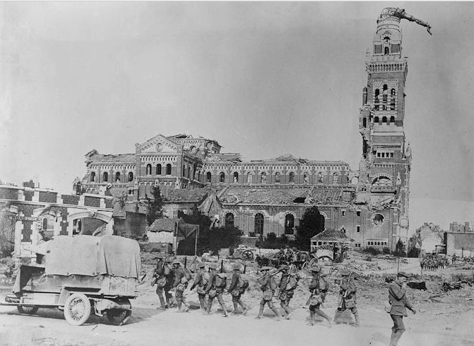{width="17.59cm"
height="12.866cm"}*The Toppled Statue of Mary Above the Troops in
Albert*

The Town of Albert itself stood out because it had been pretty much
bombed into oblivion. The statue of the Virgin Mary perched atop the
town's cathedral had been shaken from its moorings and was now nearly
horizontal. Engineers had bolted her down so she wouldn't fall and hurt
the troops, but the famous superstition among the Canadians was that a
divine hand prevented her falling, and when she finally did fall, the
war would be over.

The First Division Moves into the Somme Trenches (September 7^th^ to
September 26th)

Having been acclimatized to the area, Division 1 of the Corps officially
relieved the 4^th^ Australian Divison in the trench system near
Albert.Wilfrid's Second Brigade moved into the Left Section of the
system on September 7^th^. The Australians had just been shot to bits in
a failed assault intended to capture a fortified, abandoned farm that
would have been an effective strategic point for advances on the
longstanding German stronghold at Thiepval.

The 5^th^ Battalion was sent to the trenches situated in the Chalk Pits.
These chalk pits were described by other soldiers (from the 102^nd^
battalion) who had previously occupied the area as "a muddy depression
honeycombed with inadequate shelters, lying between Baily Woods and
Pozieres. When wet, the chalky soil was quickly reduced to a deep
stickiness which made every movement a labour." To make matters worse,
"the chalk in the ground showed as white streaks against the mud, making
the trenches highly visible to the enemy. (Cook, 425). And the German
snipers knew every inch of the area intimately, having studied the
entente trench system for months now, and knowing its weakest points,
causing a continuous trickle of daily deaths and injuries, and eroding
the already shakey morale of the brigade. And why was morale already
affected? Apart from hearing about the horrors of the Somme for two
months, the men were experiencing a level of bombardment on a daily
basis that had been but weakly foreshadowed at Ypres.

As General Arthur Currie noted in his war diary: "absolutely continuous
shelling night and day. Our casualties very severe and trenches very
bad." In the first sever months of September, the Canadians lost 769 men
during a time when none of the Canadians ever left their trenches.

Here's a photo taken of the Chalk Pits by the Australians, just weeks
before Wilfrid and his 5^th^ Battalion relieved them:

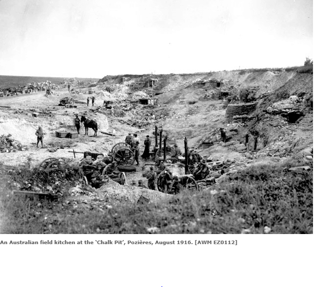{width="16.457cm"
height="11.933cm"}And here's the same Chalk Pit today:

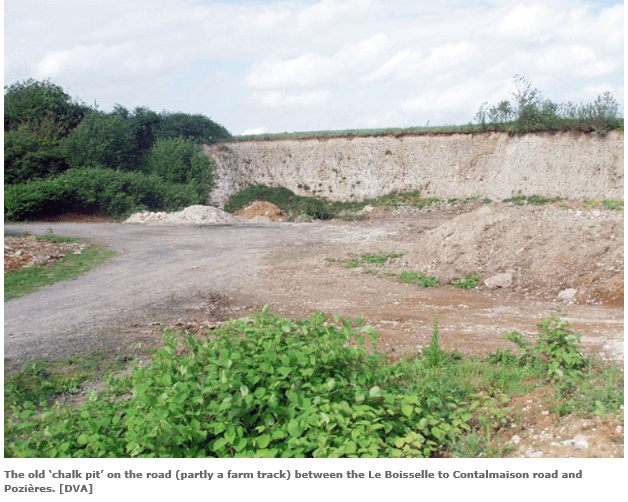{width="14.725cm"
height="11.77cm"}Wilfred and Richard wrote few letters during this time.
Wilfrid's letter from early September to the day before his wounding
(September 26) hint that he's involved in something intense and
momentous but beyond that, he says very little. Of course, he can't
writing freely because of the military censorship of any but the most
vague descriptions of action in soldiers' letters home.

On September 6^th^, just before the first Somme offensive, he says, "I
will have a lot to tell you some day about where I am at the present
time. Sorry it can't be told now but you know the censor would strongly
object....don't worry about me. I came all through Ypres without any
harm and I feel quite confident that I will come through this."

The Boys of Neepawa Start to Fall

On the 17^th^ of September, he alludes to the fact that he's writing
"amid considerable excitement." He does more than hint, though, that
he's had his first over-the-top offensive experience: "Am sorry to say
that Garfield Mitchell was killed about a week ago. He went over in the
charge but was killed by a shell shortly after. It is pretty tough but
still we all have to take our chances. Andrew Mitchell was wounded in
the charge but should recover."

Garfield Mitchell died at the age of 24. He had gray eyes, brown hair
and a fair complexion. Like Wilfrid and Richard, he was a bank clerk\--
a popular calling in those days, apparently. Wilfrid's lack of emotion
when informing his mother of Garfield's sudden end may seem odd given
that he likely went to school with this boy (they were both born in
1893), and just as likely, given that Neepawa was a small town, may have
worked alongside Garfield every day. But we've noted the coarsening of
Wilfrid's feelings and higher nature during the war years. When you know
each day could well be your last, you're less likely to mourn the loss
of your peers, particularly if their death may have meant in some
superstitious way that you were therby spared -- after all, on the 9^th^
of September Wilfrid was occupying a front-line trench, and if that
shell had fallen differently, it could've as easily taken Wilfrid's
life. At least, one can see how this kind of logic may have influenced
thoughts and feelings at thr time.

But what exactly was going on at this time? Where and when did the
"charge" take place that took the life of Garfield Mitchell, sparing his
older brother Andrew only to be severely wounded?

We know that, from the moment they were transferred to the Chalk Pit,
the Canadians were subject to unusually intense enemy bombardment and
frequent offensive charges into their trenches.

As the battalion war diary for this period indicates, the men were
terrorized by heavy and prolonged daily and nightly shelling
interspersed with sudden early-morning murderous assaults. Wilfrid's
experiences at Ypres had transformed him into a battle-hardened veteran
who could more easily withstand the shock of the shelling. Living
through the shelling of Ypres -- and especially the heavy bombardments
that buried him alive twice -- prepared him mentally and physically for
the ordeal of the Somme, and it likely enhanced his capacity to survive
the experience.

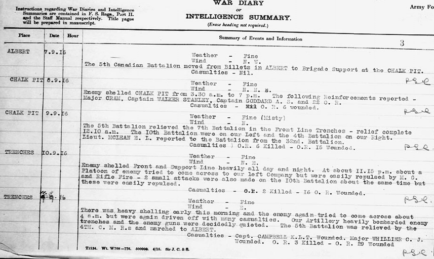{width="17.59cm"
height="10.507cm"}

Unlike Wilfrid and Richard, Garfield Mitchell only entered into active
service on the 25^h^ of June, 1916 at Ypres, after the worst of the
Mount Sorrel fighting had past. He was a rookie and his slight
experience at the tail-end of the Ypres engagement wouldn't have begun
to prepare him for the savagery of the Somme. There's little doubt that
his inexperience had at least some bearing on his early death. Garfield
was killed in action only two and a half months after the start of his
active service in Europe.

Practicing for the Courcelette Offensive

The trench bombardments and raids of the Chalk Pit were rough, but
nothing compared to terror of going "over the parapet" and advancing on
enemy lines. To prepare for the major offensive of the Battle of
Courcelette, which would begin on the 15^th^, it was decided to "launch
a series of minor operations to push out the Canadian lines and gain
more favourable starting positions."(Cook, 426)

Sadly for Garfield Mitchell, who was a member of the Second Battalion,
and luckily for Wilfred, who was in the 5^th^, the Second Battalion
rather than the 5^th,\ ^was chosen to attack the German lines in the
early hours of September 9^th^.

Descriptions of that day differ, but if we take the Second Battalion War
Diary as definitive, it went something like this:

Companies moved into position prepatory to attack, 3 p.m., companies
entered "JUMPING OFF TRENCH", dug toe holes, and fixed bayonets. 4:25
p.m. everything in readiness. 4:45 p.m barrage opened, men leaped over
parapet, and advanced as close as possible to german front line. 4:48
p.m. barrage lifted, and our right companies gained objective. On left,
our men were held up by heavy machine gun fire. At this time one of our
officers, Leightenant J. Pringle, alone, charged the machine gun which
was holding up his men, and silenced the gunners, himself being riddled
with bullets. 5:24 p.m message displaced by attaching party to Bn H.Q.,
stating that objective had been gained of 550 yards\...Our casualties
were -- 2 officers killed, 8 officers wounded (3 of those died), Other
ranks 43 killed, 142 wounded.

In this fairly minor offensive, not important enough to be included in
any but the most comprehensive book on the Canada's role in the war,
almost 1% percent of all the 6,000 Canadians who lost their lives on the
Somme were killed -- including, of course, young Garfield Mitchell from
Neepawa.

Canadian Mounted Rifles: Losing Their Mounts

And what about Andrew Mitchell? Andrew signed up soon after the outbreak
of the war (in December, 1914) --earlier than Wilfred and Richard, who
signed up in August of 1915) and had been in combat much longer than his
brother, whose inexperience was likely a significant factor in his
death.

Andrew was assigned to the 1^st^ Battalion, Canadian Mounted Rifles
(C.M.R.), which had originally been a mounted infantry unit. When the
battalion arrived in France in September of 1915, it became clear very
quickly that mounted infantry would be of little use in trench-based
warfare, and the battalion converted to common boots-on-ground infantry.

By the time he got to the Somme where he would be grievously wounded,
Andrew had been through a lot. 80% of his battalion was famously and
thoroughly decimated the day the Germans launched their first assault in
the Battle of Mount Sorrel on June 2. A total of 557 of its 692 members
were killed, wounded or captured that day. Please see the 1^st^ CMR
Battalion War Diary entry for this day in the appendix. Luck was clearly
with Andrew that day inYpres, but it ran out at the Somme, as it did for
so many others.

Battle for Mouquet Farm

Luck was certainly working in Wilfrid's favor. As the battalion diary
shows (bottom of the page), the 5^th^ retired to billets in Albert for
rest just before the first significant offensive of September 15th,
which included the Battle of Mouquet Farm (during which Andrew Mitchell
was wounded, as described below) and the main Battle of Courcelette
itself.

The strategically significant and fortified village called Mouquet Farm
had been held by the Germans, who repelled attacks by both English and
Australian troops (who called it "mucky farm," since July 23. The attack
was not successful, but it did achieve the goal of diverting German
attention from the buildup of troops in nearby Courcelette.

Wilfrid may have been misinformed when he stated in his letter of
September 17^th^ that Andrew had been wounded in the same September
9^th^ offensive that had taken the life of his brother, Garfield. Andrew
received a serious Gun Shot Wound (G.S.W.) to his left hip and a
shrapnel wound of his left knee "while in a trench" during the September
15 offensive, a little less than a week after his younger brother was
killed.

The Mouquet Farm offensive seems unusually poorly planned, even by WW1
standards, with the Canadian troops being bombarded at one point in the
battle by their own artillery. As Tim Cook tells it, "the 1^st^ CMRs
pushed into the enemy lines as part of the first wave, but suffered
heavy casualties from friendly artillery fire and especially from
defenders in German trenches, who poured machine-gun fire into the
Canadian ranks." This overview of the action -- written one hundred
years after the fact -- doesn't do adequate justice to the suffering
inflicted that day.

What follows is a very lengthy extract from 1^st^ CMR war diary from
September 15 that more vividly captures the chaos, horror and
incompetence of warfare on the Somme:

Objective: to raid Mouquet Farm and dugouts in the vicinity. Their
objectives was the enemy trenches which they were to bomb, and clean
cut, doing as much damage, and to cause as great loss to the enemy as
possible. On reaching their objective, they were to remain in the trench
for a period of ten minutes, after stated time to return to their own
trenches. At zero time 6:20 a.m the party were in shell holes out in
front of their trenches, and in rear of where our Barrage should have
been. *However, at 6:25 it was found that our Artillery, instead of
playing on the Enemy's line, many of the shells fell amongst our own
party, inflicting many casualties, including the officers leading the
party.* After the barrage lifted it was found that the enemy's line was
intact and very strongly manned, and when our men advanced they were met
with a shower of cylindrical sticks as well as heavy rifle and Machine
Gun fire. In reply our men answered with bombs and rifle fire. This
party occupied a line of shell holes in front of the Enemy Position from
which a heavy fire was kept up by the enemy until our men had suffered
many casualties.

At 6:40 the enemy began shelling our front line vigorously. The hits
were infrequent until about 10:30 a.m. when the range was perfect, with
the result that many casualties were inflicted. This shelling was kept
up without intermission until 7 p.m.. After this it was shifted back and
barrage established between front line and support which was kept up
until midnight. The machine gun and rifle fire, especially sniping, was
incessant throughout the day.

The Companies suffered heavily, especially the right company, in which
out of 5 officers, three were killed and two wounded. The total
casualties during the tour were as follows: 6 officers killed, six
wounded. 64 Other Ranks killed, 173 wounded and 9 missing.

The Wounds of Andrew Mitchell

When he was sent to England, "the wound was very septic. Pieces of bone
were removed on three different occasions. The left knee joint became
infected, was opened and pus drained." The doctor who initially treated
Andrew in the field, noted that "the wound was very deep and very
unhealthy looking and required drainage to be inserted for two days, and
afterwards the wound to be packed with sulphur. I removed some loose
fragments of bone at operation but many still remain attached to rotator
tendons."

He was sent to a Canadian military hospital in Bramshott, England to
recover, but Andrew did not recover well; Andrew's hip, thigh and knee
remained infected until October, 2017 -- over a full year -- and the
result was "almost complete anklyosis of left knee joint, with only
slight movement of hip joint." In other words, he could bend neither his
knee nor his hip ever again, and he was thereafter seriously
handicapped. He would never be able to walk without extreme difficulty
again. Coincidentally, a full year after Theipval Ridge battle, and
after recovering from his relatively minor leg wound sustained there,
Wilfrid was assigned to clerical duties in the No. 12 Hospital at
Bramshott, where he met up with Andrew Mitchell who was still bedridden
with his wounds. Wilfred said, "Andrew Mitchell is in this hospital. I
was talking to him the other night He is looking very well but left leg
is crippled. He is goinjg back to Canada on the next boat."

WW1 gunshot wounds, one of which would "invalidate" Wilfrid as well
within a week of Andrew's wounding, were almost always problematic.
Infection was a serious and frequent complication (Wilfrid's wound also
became seriously infected):

Infection was a serious complication for the wounded. Doctors used all
the chemical weaponry in their arsenal to prevent infection. As there
were no antibiotics or sulphonamides, a number of alternative methods
were employed. The practice of 'debridement' -- whereby the tissue
around the wound was cut away and the wound sealed -- was a common way
to prevent infection. Carbolic lotion was used to wash wounds, which
were then wrapped in gauze soaked in the same solution. Other wounds
were 'bipped'. 'Bipp' (bismuth iodoform paraffin paste) was smeared over
severe wounds to prevent infection.

Andrew was in and out of British hospitals until November, 1917, when he
was finally "invalidated" as medically unfit and sent back to Canada
with a medical discharge. He was under-weight by 30 pounds. His height
at discharge was 5'11", weighing only 130 pounds he was a poor specimen.
He'd been in English hospitals for 14 months and would be forced to
remain in Canadian hospitals for the next nine months.

On returning to Canada, Andrew was admitted to the Manitoba Military
Hospital in Winnipeg, where his condition was more fully assessed:
"There is permanent anklyosis of both hip and knee, left side. Hip
considerably adducted \[twisted inwards\]. Recommend excision of hip
joint so as to restore movement."

He was admitted to the Winnipeg General Hospital on March 26, 2018,
where he had his hip excised -- cutting away the flesh to halt current
and prevent future infection. The result was "considerable suppuration
and swelling after operation \[i.e., loads of infection again\].
However, his doctor declared that by May, the "wound is healed", despite
the fact that the "patient complains of difficulty in moving his limb."
A week later, the "wound had broken down again." In June, "particles of
bone were being discharged from the wound site, and the patient "is
advised to use a walking stick." And basically sent home and told to
dress the "fresh daily discharge" ever day.

After having part of his hip removed, he performed clerking duties at a
Military Record Depot. Bone loss in his hip and femur meant that his
left leg was two inches shorter than the right, and he was permanently
crippled\-- but he had been promoted to the rank of Corporal and
decorated with a gold bar.

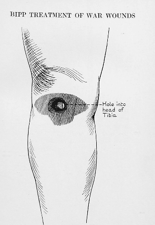{width="4.045cm"
height="5.863cm"}

The Battle for Courcelette

And, finally, we come to Battle of Courcelette, in which so many
Canadians were wounded and killed. But Wilfrid was not among either of
those, as the entire 1^st^ Division was resting up for the Thiepval
Ridge offensive coming up on the 26^th^. The star division of the Battle
of Courcelette was Richard Buckley's third division.

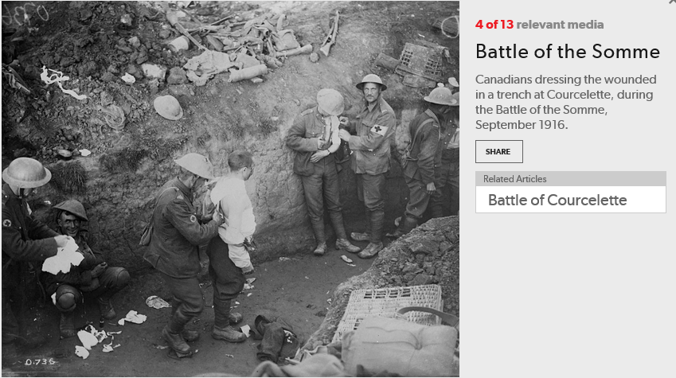{width="17.59cm"
height="9.841cm"}

September 15^th^ was the day of the main assault on the village of
Courcelette, and it was a day of bloody victory for the Canadians. The
2^nd^ Division, with the 3^rd^ Division (Richard Buckley's Division)
protecting the left flank, managed to take the village from the Germans.

The 1^st^ Division, of which Wilfrid's 5^th^ Battalion was a part, were
not involved in this very famous Canadian assault. That day, Wilfrid's
battalion was well behind the lines at the Brickfields of Albert,
participating in training exercises. The entire 1^st^ Division was
resting up for their next scheduled assault on September 26, the Battle
of Thiepval Ridge.

So, the Dunlop family has been confused for many years. Robert and
William Dunlop both thought that their father was wounded at the Battle
for Courcelette -- the first battle in which the lumbering British
prototype of the tank was launched, with very limited success. Wilfrid's
final day of soldiering in France occurred during the Battle of Thiepval
Ridge, some 11 days later.

This battle was also the first one in which the British-invented tank
made its debut. It's interesting to note that it was developed primarily
as a means to crush the barbed wire that impeded the troops from
attacking enemy trenches. However, they were far too slow, mechanically
unreliable and easily knocked out by artillery fire to be regarded as
menacing.

Six of the new tanks were supplied to the 2^nd^ Division, who were the
main assault troops for the battle, charging straight into the town of
Courcelette -- and being mowed down by the defending Germans' machine
gun fire and artillery. Despite terrible odds, the Canadians prevailed
and the battle was deemed a "stunning success". The Canadians fought
long and hard and by the end of the battle, the town of Courcelette had
been captured from the Germans, but, like most WW1 victories, it was a
very costly one. More than 1,000 Germans were captured, and the same
number killed, while the Canadians racked up a horrific total of 7,230
casualties.

Richard Buckley wrote to Nellie in mid-November from a Convalescent
Hospital in Kent. As usual, Richard's letter contains a rich amount of
detail and emotion as he describes the battle:

I was not in the same engagement as Wilfrid in September \[Theipval
Ridge on September 26^th^\] as we were out for a rest just then, after
our very brilliant performance on September 15^th^ and 16^th^ as our
brigade had a big hand in the advance made on those days, and the 15^th^
of Sept. will not be forgotten when Canada's work in this war is
written. Charles Thompson was slightly wounded in our last visit to the
Somme. His battalion had a rough time and Charlie said he had
extraordinary luck to come out as he did. Out of a crew of eight on his
gun, he alone got through, and though slightly wounded, he remained with
his gun till his unit was relieved next day. Poor Reid Howden went under
in the same attack. I understand he was just hurling a bomb from the
trench when he was hit bad enough not to let him recover. Harry Woolsey
felt Reid's death very much, having been with him so long. I am sorry to
say our own company lost a few of our oldest and best men, including an
officer who, to me at least, was the finest officer I have even seen in
France.

This "break in" by Canadian troops that managed to dislodge the Germans
from the town of Courcelette was the first action at the Somme that
could be declared a victory. "The larger British offensive," declared
Tim Cook, "had achieved minor results at best."(p. 468)

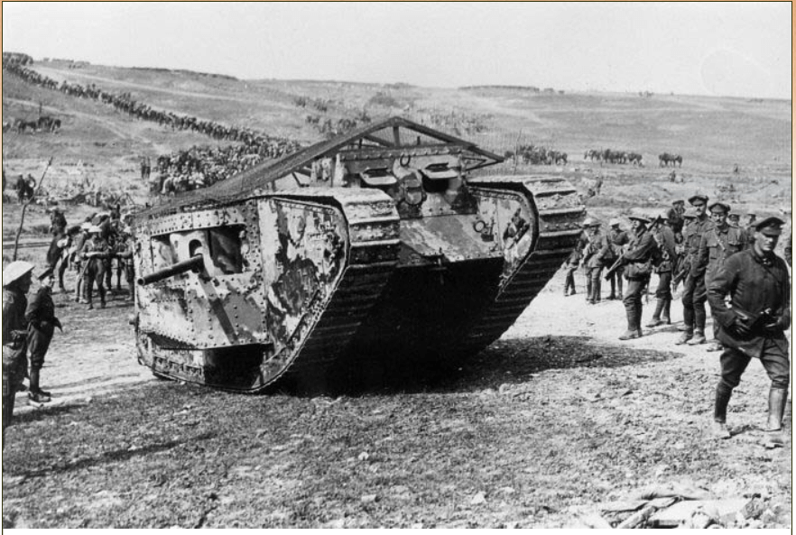{width="16.549cm"
height="11.125cm"}First Tanks Rolled Out

The British Generals in charge of both the BEF and CEF (British and
Canadian Expeditionary Forces) determined it was important to continue
relentlessly to wear the Germans down, so they sanctioned only a short
hiatus between major assaults -- only 11 days intervened between the
Battle for Courcelette and the Battle of Theipval Ridge, which would
take place on September 26^th^.

The Battle for Thiepval Ridge -- Wilfred's Final Day in Active Service

During the 11-day hiatus between attacks, the troops who would be
involved in the assault were allowed to rest and to practice their
assault maneovers. The 5^th^ Battalion stayed in billets in Albert for
most of this period. Immediately prior to the attack, on September
24^nd^, they were moved back to the chalk pits from their billets in
Albert. And the day after that, they marched to the front line trenches
to relieve the 7^th^ Battalion, in preparation for the next day's
assault.

Tension must have been unbearably high those last 48 hours. For many of
those men, Wilfrid included, this would be their first experience of
going over the parapet in a large-scale, multi-brigade, entente-driven
offensive. Their time had come to prove themselves as the aggressors in
a major conflict on the world stage. In the 5^th^ Battalion war diary
for September 25^th^, the battalion commander states that "everyone is
keyed up for it is what many have put in 18 months waiting for."

That excitement is clearly communicated in Wilfrid's letter to his
mother written on the day before the assault, from the trench he would
climbing out of the next morning. The scanned version of this letter is
not very clear, mainly because the original, written in a trench in
state of intense anticipation, was not all that legible. I'm also sure
it was passed through many hands when it was received, so it's now in a
poor state:

"When I get back home I will be able to tell you the circumstances under
which this letter is written. Tomorrow is going to be a big day in the
history of the "fighting fifth" and the rest of the second brigade. I
don't suppose you will be able to guess what I mean but I am sorry that,
on account of the censor, I cannot make myself any more plain except
that by the time you have received this letter, we will have been over
the parapet and at them. Now, there is no use worrying about me. I will
send a "whizz-bang" \[a military postcard with check boxes to
communicate a soldier's status to his family\] as soon as it is over and
you will know then that I am alright. I never felt better in my life
than I do now,and am confident that I can hold my own when the time
comes."

The time came alright, and there's no better description of it than the
unusually florid and poetic description of the battle from the 5^th^
Battalion War Diary. It's very detailed and describes the events of the
day with a precision which is very unusual for a battalion diary entry:

"The morning dawned clear and cool; there was very little artillery fire
till about 11:30 a.m. when quite a lot of heavy stuff was fired into
Regina Trench. The men had taken up their position during the night in
the kick-off trenches and numerous shell holes and were all prepared for
the signal. About 11:40 the artillery opened up and kept up a heavy fire
in the front of and on the enemy works. At 12:34 p.m. the numerous
machine guns placed behind our lines for creating a barrage behind
Regina Trench opened up, and sharp at 12:35 the artillery opened up an
intense barrage just in front of our men.

This barrage gradually lifted and the attacking force scrambled out of
their temporary shelters and advanced close behind it \[this is the
famous newly developed tactic called the "creeping barrage" that worked
every so much better than just walking slowly toward enemy machine gun
and artillery fire and being mowed down by them\].* The first objective
was the Zollern Trench some 300 yards in front*, and it was reached,
taken, cleared and consolidated with very little trouble and quite a
number of prisoners were secured and sent back, all of them helping to
take our own wounded. The German barrage fire could not be said to have
opened properly till nine minutes after the attack had been launched.
During the advance quite a lot of sniping tool place and needless to
say, no mercy was shown to the huns who kept that up till cornered, and
then threw up their hands. By the time the first wave had reach the
first objective, they had been thinned down considerably, but by the
time of the third wave, consisting of the Mopping Up party reached the
trench, the first and second waves had united and went forward as one to
the second objective, which was the Hessian Trench....the casualties
between the first and second objectives were very heavy and the number
of men who reached the Hessian Trench were few indeed, but by 2 p.m. we
had occupied and were consolidating this trench\...D Company \[this was
Wilfrid's company\] on the left was some distance ahead of the right
flank of the 8^th^ battalion."

I'm only quoting the first part of this lengthy entry because I believe
that Wilfrid was injured at about this point. I'm basing my guess on his
own description of what occurred, which you can find in the first letter
he was able to write his mother, on October 4^th^. Again, that letter is
not very legible and didn't scan well, so I'll quote his description of
the attack in full:

"The good old Fighting Fifth lived up to its name and took all the
trenches that was mapped out for it to take. I was just fifteen yards
from our objective when I was hit, and the shelling was so fierce that I
had to lay in a shell hole for a day and a half before I was carried
out. My God! It was awful. But I am away from it all now for three
months at least."

When he writes to his sister, May, Wilfrid is a little more explicit:
"The fifth were in the charge near Thiepval on September 26^th^. We went
over at 12:30 noon. I got within fifteen yards of our objective when I
was hit. I got a piece of shrapnel through the leg just above the right
ankle\...after being hit I was lying in a shell hole for a day and a
half. It was awful but I was mighty lucky to come out of it with such a
slight wound."

In an even later letter to his mother, Wilfrid is even more specific:

I do not know whether I told you in my last letter the time and place
that I got mine. Well, it was on September 26. The whole of the 1^st^
Can. Division popped the parapet, or I should say, the 5^th^, 8^th^,
15^th^ and 16^th^ Battn's went over with the rest in support. It was
just alongside of Courcelette between there and Thiepval. We sure gained
our objective and took a bunch of prisoners.

There are not that many photos from individual assaults, but, oddly
enough, I found a photo labeled "Wounded Soldier Being Carried Out of
Shell Hole After the Battle of Thiepval Ridge". Wilfrid's experience
must've been very close (if not identical) to what we see in this photo
-- a soldier being carried out of a giant hole in the ground, filled
with the detritus and remains from what I think was a German trench (the
distinctive German grenade stick is one of the few identifiable objects
among the litter of sandbags and general destruction):

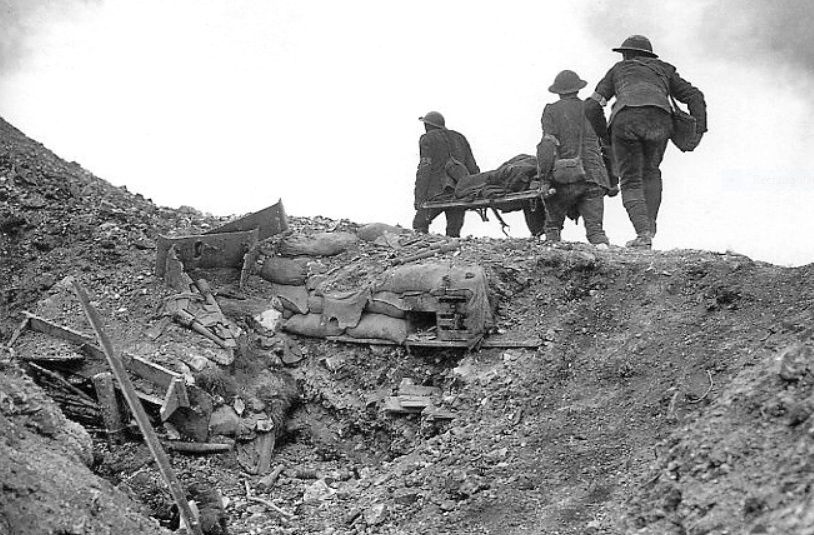{width="14.695cm"
height="9.659cm"}

I also found this amazing night-time shot of the bombardments at the
Thiepval Ridge Battle, which must've kept the sky lit up for Wilfrid as
he lay in his shell hole in No-Man's-Land.

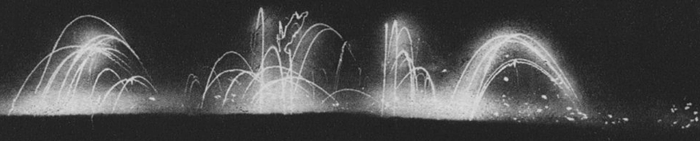{width="17.59cm"
height="3.552cm"}

The assault that day (and night) involved the first Division attacking
three separate trench systems: the Zollern Graben, Hessian and Regina
trench systems. It would appear that Wilfrid was hit just in front of
the first trench objective: the Zollern trench. Wilfrid was certainly
not alone. As Tim Cook states, "The Zollern and Hessian trenches were
attacked and held, but at a terrible cost. On the 5^th^ Battalion's
portion of the front, 16 officers were killed, and of the ranks, 52 were
killed, 291 wounded and 122 missing. Wilfrid's name, directly after the
battle, would've been among the missing.

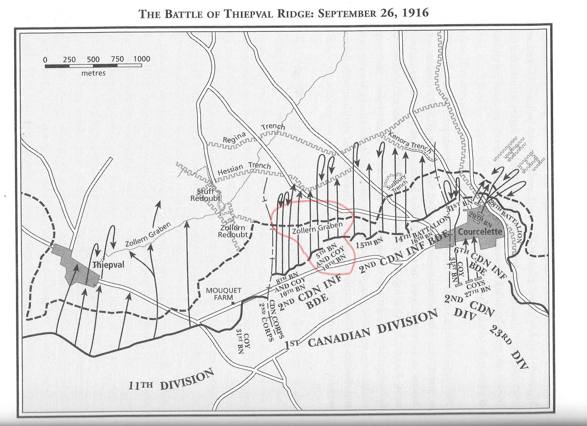{width="12.472cm"
height="9.073cm"}

The Battle of Thiepval Ridge lasted another two days and was "a study in
nearly unimaginable brutality. Attacks raged back and forth over the
same shell-torn ground, with the infantry savagely fighting for every
square metre of territory."(Cook, 483) The battle was, apparently, only
a partial victory because not all of the trench objectives were reached.
One thing was very clear, though: the assault battalions were decimated,
and those who remained standing were both physically and psychologically
shattered by the ordeal.

Among the dead was a Neepawa boy Wilfrid apparently knew and mourned.
His name was Hugh Gardner and he was killed in action on September 26th
near Zollern Trench, where Wilfrid was wounded on that same day.

Wilfrid sent his mother a letter on October 22^nd^, a little less than a
month after he fell, that included a rather touching postcard of a
professional portrait of two soldiers, one of whom was Hugh Gardner.

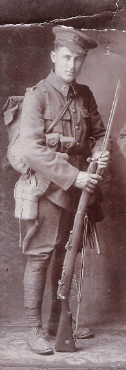{width="3.334cm"
height="9.79cm"}Hugh Gardner

This postcard must've been pretty special to Wilfred, as he sent it so
his mother so she could keep it safe for his return. On the back he
wrote the name and place of death for each of the soldiers in the
portrait. Here's what he said about Hugh:

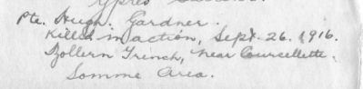{width="10.557cm"
height="2.593cm"}

Hugh Gardiner (not Gardner, as Wilfrid wrote) had blue eyes and brown
hair, and was two years younger than Wilfrid (just 21 years of age).
Just like Wilfred (and most everybody else) he was a clerk (was there
any other occupation for men in Neepawa?). Hugh had signed up in
December of 1914 and so had been among the first contingent of Canadian
soldiers to have sailed over to England in early January 1915. He had
never been wounded or had a medical issue that kept him out of the
action. He had been granted and enjoyed just one period of leave while
he was in Europe. In early May of 1916, he was given 9 days leave of
absence. But his luck finally ran out as he approached the Zollern
trench that day in September of 1916 when his body was torn apart by
bullets or shrapnel or both.

Reprieved from Hell: Wilfrid's "Dear Sweet Little", "Dandy Easy" Wound

Wilfrid's luck held that day. In his first experience going over the top
in a major offensive he was wounded in the leg, by a piece of shrapnel
(or a bullet) that went clean through his right leg just above his
ankle. The wound was sufficiently debilitating to keep him out of harm's
way for at least three months.

The Dunlop family was notified immediately via one of the usual
"sincerely regret to inform you" telegrams that Wilfrid had been
admitted to the Red Cross hospital in Etaples, France with a wounded
right leg. Fairly soon after, Richard Buckley wrote a sweetly reassuring
letter on the 28^th^ of September to Nellie, informing her that "Wilfrid
has been slightly wounded and is well on his way to England\...George
Fairbairn told me today is was a nice wound\...You know we always feel
like cheering when we know a friend of ours has gone to Blighty, as we
call England."

I suspect Richard asked George to write a note to Nellie as well, which
he did (just as he had when Wilfrid had severe shell shock). This letter
is very hard to read in its scanned form, as it was written on thin,
almost transparent paper in pencil in a very tiny hand, so I'll quote it
at length here (spelling mistakes included):

Well, we have been in it nice and heavy lately. The old fighting fifth
has lived up to all previous record. In fact excelled them. Wilfred, the
lucky boy, got a beautiful blytie (sp). Which will give him a few months
rest from this lively noisy life. He got a small piece of shrapnel in
his ankle. One of the small bones may possibly be broken. All of us
Neepawa boys sure envy him this trip to England. And he sure is a happy
boy. He came into the Dressing Station all smiles and as his was a light
case we had him in for most of the day clearing the serious as fast as
possible. And believe me we were what you would call busy as we were
dressing for about 12 battalions, all of which were in the big scrap. No
doubt this time time you will have read all about it and Wilfred no
doubt will send a full description. Don't worry about his wound. It is a
dandy easy one. I'd give him quite a bit for it as it may mean a winter
pass to England. M.H. Smith joined our battalion on the latest draft
from England and he also managed to get a piece of shell in his leg.
Just had about 14 hours in the trenches. So he didn't have to go through
many hardships to get his blytie, eh? All the rest of the Neepawa boys
in our brigade came through OK and will have something to talk of for
years to come.

When Wilfrid finally was able to write to Nellie on October 4th, his
mood is buoyant -- and remains so for the entire course of his
hospitalization. Having little to do but lie in bed and be looked after
by pretty nurses clearly agreed with him. He begins the letter with an
uncharacteristic exclamation of joy:

Hurrah! I got a nice "blighty." I guess you have been wondering what
kind of wound I got etc. and etc. Well, there is absolutely no need for
worry. I am feeling fine and have a dear sweet little shrapnel wound
over the right ankle. The piece went through -- went in above the ankle
and came out just below and in front of the ankle.

Typically, he can't resist making a sneaky request for some cash near
the end of the letter: "When I get out of the hospital I get ten days
leave and it all depends on how much money I have that will make me
decide on where I will go." He concludes with "rest assured that I am in
the best of health and spirits and am all tickled to death that I have
been "safely wounded." A final postscript asks mom to "send cigarettes
as we get no money while in hospital."

Wilfrid also mentions M.H. Smith in his letters, as being so luckily out
of the war after less than a day in the front-line trenches. He was not
that lucky, though, in his wound. Typically, it's Richard Buckley who
writes about "Smith" as he was called with more compassion. Richard
writes from his furlough in England in April of 1917: "Smith came up
from Eastbourne and stayed four days with us. It wa sjolly nice to meet
him again. He looks very well in spite of his shortened leg, and has
already learned to skip along quite spryly on his two sticks. I think we
rather tiredd him out by taking him up and down the tubes when taxis
were not to be had."

The evidence of his letters suggests that Wilfrid enjoyed himself
immensely in the Stoke-on-Trent hospital he was sent to. He describes
making up parties of 5 to 7 patients and going out for "elegant" parties
in which tea -- or possibly something much stronger -- was enjoyed at
least once or twice a week. One of these so-called tea parties involved
playing prodigious amounts of pool, at which Wilfrid apparently
excelled. From these letters, we see a different side of Wilfrid -- a
sociable, garrulous and extroverted young man. He seems to have had the
knack of making friends easily. We saw this in 1915, when he was newly
arrived in England and in training. Then, he befriended both men and
young women and pined for the money to socialize more. Within the town
of Stoke-on-Trent ("the people around this city are dandy"), he met the
Cowlishaws, a family with whom he kept up a close relationship
throughout his long stay in England.

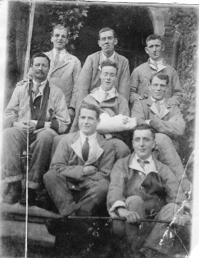{width="7.62cm"
height="9.895cm"}A Smiling Wilfrid (front right) with 3 Canadians,

2 Australians, and 2 "Imperials"

His elation at being freed from the wet filthy hell of the trenches and
the constant threat of immanent death or dismemberment -- and by what is
apparently such a slight wound -- is communicated most directly in his
letters to his sister, May. The letters to his mother are more sober in
tone, and I suspect she would not have approved of his being so
overjoyed about his current situation. Here's his description of a fun
party in Newcastle in a letter dated October 20:

The people here are dandy. I was out to tea last Sunday with some very
nice people and yesterday I was with seven others to a little party. We
had an elegant time. All afternoon we played billiards and then sat down
to a square meal. I won the snooker pool contest so I was entitled to
the lion's share of everything at the tea table and believe me I did not
leave anything. It was the best meal I have had since I left home. Am
going out again next Sunday. This is sure a great life. Beats France all
to bits.

In the very next paragraph, his happiness gives way to survivor's guilt.
He writes about a letter he received from Richard Buckley, who told him
that George Evans ("who used to work at the Hotel Hamilton") had been
killed and that Reid Howden and Charlie Thompson were missing. "It is
pretty tough luck on the poor fellows and it makes me thinks how lucky I
was. I thought I was hard pressed when I had to lay out in a shell hole
in "no man's land" for a day and a half before I was carried out but,
after all, it was not so very bad, now that I am away from it all." In a
letter to his mother on October 16, he tells her that Richard Buckley
"came through the Somme battles O.K. as the Canadians are away from
there now. I am anxious to hear about the casualties. Some of my best
pals were killed in the charge and there are others I have not heard
about yet."

One of those he was anxious to hear about was Stanley Rooney: "I hear
Stan Rooney was wounded also heard he was killed. Which is correct?"

The two Neepawa men who had gone missing had mixed fates. As reported by
Richard Buckley in his letter of November 13^th^, 2016, Reid Howden was
among those killed trying to capture yet another trench (the Regina
trench) after the Battle of Thiepval in early October at the Somme, just
as Wilfrid was beginning his very enjoyable "blighty" experience of
frequent tea and billiard parties, and dinner at the Cowlishaws with
their very agreeable daughters.

Reid was another clerk (how could there be so many clerking jobs in one
small town?) from Neepawa who joined up at the same time as Wilfrid and
Richard (August, 1915) and was 21 when he was killed on October 10^th^.
The official records for young men like Reid are distressingly lean and
brief. Partly, this is because Reid had never been sick or experienced
shell shock, so his records are bereft of information apart from the
bare facts that he enlisted in August of 1915 and was dead in October of
1916. Unlike Wilfrid's file, this one is short, terminating abruptly
with the bald and pitiless statement that Reid was "previously rptd
missing now rptd Killed in Action." His father would receive his medals
and decorations, and his mother would receive a memorial cross. End of
story.

 In the same letter, Richard describes Charlie Thompson's bravery during
that same battle:

Chas. Thompson was slightly wounded in our last visit to the Somme
front. His battalion had a rough time and Charlie said he had
extraordinary luck to come out as he did. Out of a crew of eight on his
gun, he alone got through and though slightly wounded, he remained with
his gun till his unit was relieved next day.

Continuing Convalescence

When first wounded, Wilfrid expected to be sent back to the trenches in
about three months. He also expected to leave the hospital and be sent
to a Convalescent Camp at the end of October. However, his wound did not
heal with the rapidity of the originally optimistic prognosis. Instead,
his foot became dramatically swollen when he got out of his bed and
began to crutch around the war.

Well, here I am back in bed again. Got up for a day or two on crutches
but my foot all puffed up again. Either one of the small bones, on the
outside of the leg just above the ankle \[likely his fibula\] is broken
or the tendons are torn away and bones are out of the sockets. However,
they are going to put it underthe X-Ray and will know more about it
then. In the meantime it is very painful abut that does not alter the
fact that it is a dear, sweet little wound becauseit will keep me away
from the firing line for at least three months and maybe all winter.

\
Nearly six weeks after the wounding, in early November, Wilfred's
letters became more dispirited as he writes that he will have to remain
in the hospital for the foreseeable as his wound is not healing as well
as expected.

Am still in the same old place, although, over a week ago, I was marked
ready for convalescent. However, during the past week, my wound has been
giving me considerable pain and is not healing as quickly as it should.
If it does not improve iwthin the next week I fear I shall have to
undergo an operation as the doctor thinks there may be some dead bone in
there that will have to be fixed.

Despite the fact that his wound has become somewhat less "dear" and
"sweet" as time has passed, Wilfrid's good humor remains intact:

Was out to tea again yesterday and had a fine time. By jove! There sure
are some fine people around this place. They will do all they can for
the wounded. It helps a lot you know, especially with those so far away
from home. I am going out to tea again on Sunday\...It rains every day
over here but believe me it is a million times better than France. I am
not at all anxious to leave here, it is a dandy place are the sisters
are A1., but I guess I will have to break away some time. I certainly
have had a fine time since coming her and hope that when I go to
Convalescent the fun continues.

Then in the third week of November, the wound took a turn for the
decided worse, with septic poisoning entering the clinical picture. He
assures Nellie that this turn of events is "quite common in the case of
shrapnel wounds. Despite this, he remains confident that he'll be sent
to a convalescent hospital soon. In this same letter of November 18^th^,
he writes that he's had sad news from France about his Company from his
Sgt-Major:

When the Company came out \[of a charge/assault\] there was only 32 men
left \[the pre-charge number would have been anywhere from 100-150\]. A
lot of the lads who just got slight wounds, while we were in the charge,
were in too big a hurry to get out to the dressing station and on their
way out were blown to bits by shells. Well, when I got hit I crawled
around and found a good shell-hole and stayed in it until the heavy
shelling ceased. I was in it for a day and a half but that was better
than being blown to bits, eh!!!

Despite this sad news, Wilfrid's implacable cheerfulness cannot be
suppressed for long. The very next paragraph is about another pleasant
social engagement at the Cowlishaws' and ends with a jokey reference to
how healthy he looks now. Some might call this insensitivity, but I
prefer to think of it as the strong Dunlop tendency to make other people
laugh, even if it's at the expense of others (or oneself):

I will be enclosing some more snaps in this letter that we had taken at
Mrs. Cowlishaws' last Monday. I guess when you saw the last one, you
said to yourself, "The poor boob doesn't look very sick!"

A letter a week later suggests that he will be sent to Convalescent
immanently, but the main news is that he has received a letter from his
papa! And it contained a money order for \$20.00: "I received father's
letter this week with a m.o. for \$20.00. By the powers, I have been
kicking my heals (sic) up ever since. It sure will be a big boost for my
ten days leave." So much for the family myth that Wilfrid was totally
ignored by his father throughout the course of the war! In the same
letter, Wilfrid talks about what "good sports" the three ward sisters
are: "I have a good stand in with them all and that makes it all the
easier for me." It's easy to imagine that Wilfrid, with his easy-going,
handsome demeanor and his jokey, teasing cheerfulness, must have been a
well-liked patient -- not unlike his son, Robert, who could never resist
teasing and making his nurses smile or laugh when he was in hospital, as
he frequently was in the final years of his life.

November gives way to December, and when we next hear from Wilfrid, he's
still in same Stoke-on-Trent hospital, and happy as can be about it:

Well, here I am still in the hospital. However, I am in no hurry to
leave as I like it very much and am certainly having a grand time. I
have received three letters from you this week, also three copies of
Life magazine and two big boxes of cigarettes. Pretty good for one week,
eh? I am might well supplied with cigarettes now and am feeling fine so
why should I worry???

William Miles: Another Irish Orphan

But news of the Neepawa boys in France just kept coming. Nellie keeps
herself busy sending parcels not just to Wilfrid but to many other
Neepawa soldiers as well. She receives a letter from William Miles, who,
like Richard Buckley, was a young Irish immigrant who signed up at the
same time as his friends, in August, 1915. And, you'll be shocked and
surprised to learn that he was a clerk! Clerical workers were clearly a
major part of the Neepawa workforce. Unlike Richard, he was an actual
orphan (Richard's parents still lived in Ireland), whose only relative
was an Aunt living in London, who was also named as his beneficiary
should he be killed in the field.

Unlike Richard's extravagantly well-mannered, almost courtly letters,
William is plain spoken ("thank you for the "box" you mention which I
guess will arrive in due course") but just as informative as Richard
when it comes to the fate of other young Neepawa soldiers.

Am glad to hear that Wilfrid is having such a good time in "Blighty"; it
will do him a world of good and he certainly deserves a rest. I don't
know how I managed to go through the same ordeal and never received a
scratch. This front which we are now holding is rather quiet for a
change. The weather, though, is *very* wet and cold, our trenches are in
an awful condition.

I will gladly remember you to any of the Neepawa Boys I happen to meet,
although George Fairbairn and I seem to be the only two left in this
Battalion (the 5^th^).

William was a bit of a star -- and he clearly had a lucky one looking
over him. He was never wounded, even though he was only out of the war
for a few weeks for some officer training and then he was sidelined to
England to recover from tonsilitis, which was a serious disease in those
pre-antiobiotic days. William distinguished himself with his attention
to duty, and was rapidly promoted, first to Lance Corporal, then to Full
Corporal and finally to full Sargeant.

This represented the kind of military career trajectory that the Dunlop
family likely expected from Wilfrid. But, for reasons that will become
very clear as we continue to explore his letters and his records,
Wilfrid came close on a few times to permanently moving up to officer
class but his weaknesses (his character flaws, if you like), his love of
an easy life and his lack of ambition trumped every attempt to better
himself while in service.

In this same letter of December 7^th^, William Miles commiserates with
Nellie over the death of a young Neepawa soldier named Sedley Monnington
-- an unusual name for a young man with an unusual occupation as well.
Not only was he not a clerk but he was, of all things, a professional
musician. William wrote:

Yes, I was surprised when I read about Sed Monnington's death. His
family must feel the loss immensely.

Nellie must have mentioned Sedley's death in her previous letter to
William, as he is here responding to the news she sent him. Nellie must
have felt really terrible about this young man's death, as she also
mentioned it to Wilfrid. Wilfrid's response on December 8th is blunt,
cold and lacking in anything like genuine pity:

It was too bad about Sed Monnington. However, he had to take his chances
the same as the rest.

Almost in the next breath, he talks about how well and generously the
sisters are treating him as he suffers from a "nasty cold", giving him
"a jug full of hot lemonade and brandy, four aspirin tablets and a hot
water bottle."

We have to note again in passing the relative coarseness of Wilfrid's
feelings for those other than himself. Sedley Monnington died at the age
of 22 during a Somme assault from gun-shot wounds he received to his
head, arm and buttocks. He was the only son of a large family composed
mainly of daughters . Born in 1858, his father, James Henry Monnington
was a well-known and loved pioneer in the area, having actually paved
the main streets of Neepawa in its early days. He lived to the age of
92, no doubt having mourned his only son for over three decades, and
then was buried in Neepawa's Riverside Cemetery in 1950. Young Sedley
was buried in the Contay British Cemetary in the Somme area when he was
one month shy of his 23^rd^ birthday.

Meanwhile, Wilfrid's cushy life at the hospital went on much as usual,
each day, though, bringing a fractional increase in comfort as he
continued to charm the sister nurses and help them with their duties.
Here's a lengthy description he wrote to May of the ease and comforts he
enjoyed:

In all probabilities I will be here \[at the hospital\] now for Xmas. I
hope so any way as I am sure to have a good time. The sister who used to
be in charge of our ward has been promoted is now the night
superintendant. I sure had a good stand in with her and every morning
now about four a.m. she has a cup of hot tea and some toast sent in to
me. This morning she sent me in some home-made mince pie. Some life
this. What think you? Is there any reason why I should want to leave
here in a hurry?

When writing to Ruby, to whom he was closest in age (she was his little
sister), Wilfrid could be quite funny. This from a letter to her just
before Christmas:

I have about "umpteen" invitations out to Xmas dinner and I think I will
accept them all so that I will be sure of getting a square meal. I
certainly am going to have a big time. Give my regards to all the
natives including "Wanshau du Panchau, Esq" \[the family dog\] and don't
forget to write soon and often.

Wilfrid's xmas wish came to pass: He got to stay in his beloved hospital
over the Christmas season. There we find Wilfrid in top form and at the
peak of giddy happiness and pleasure. He writes to his mother on
Christmas day: "Well, this is Xmas day and a vastly different one to
what I spent last year. Gee! But I have had a great time:

Did I tell you about the bets I had with the 7 sisters about catching
them under the mistletoe? \[Wilfrid had bet each nurse one dollar -- no
small sum in 1916 -- that he would kiss them on Christmas Day) Well, I
won them all. I suure have caused a sensation around the hospital. I
certainly have had an exciting daychasing them up and down the stairs
with a piece of mistletoe in my hand. They have nick-named me "Flirt".

Wilfrid's comfortable and easy hospital life would soon come to an end.
In the closing days of 1916, Wilfrid would enjoy his last few days of
repose and indolence, and, although he would never enjoy such ease and
freedom from care again, he would never have to return to the
battlefield. He enjoyed being a patient, and had a full three months of
it, but he couldn't remain one forever. As he told his mother in a
letter dated Feb. 4^th^, 1917, "I have had no pass whatever since
October 1915 and we are supposed to have a pass every six months.
However, my three months in hospital made up for the lack of holidays as
it was just one long joyful holiday in itself."

Medical Board Declared Wilfrid Unfit for Active Duty

The Medical Board met on January 15^th^, 1917 and declared Wilfrid unfit
"for further active service in France" and was waiting to be posted to
the Canadian Army Pay Corps (C.A.P.C.) Paymaster's office. The judgment
of the board was based on this summary of his present condition: "Bullet
entered leg from behind about an inch above right ankle maleatus. The
wound is scarcely healed with redness and swelling over entrance."

Wilfrid describes the episode to his sister as follows: My transfer to
the Canadian Army Pay Corps is now pending. This means that I am now
"bomb-proof" for the duration and do not have to worry about France or
loousy dug-outs or fleas or rats and all other kind of miserable vermin.
I have had my fill of all that. I still have some of the scars on my
body yet from louse bites. They are fine little souvenirs of the war but
the best scar of my wound is the best of the bunch. When I went before
the Board they took a look at my wound and that was enough. There is a
growth on the bone that is a hard swelling about the same size as my
ankle."

He wrote his mother with the same news, adding that the swelling "could
be easily fixed if I undergo an operation but that does not appeal to me
as I would be all right after it and would have to go back to France
whereas by leaving it as it is I am "bomb-proof". So there is no further
need to worry about me having a "Jack Johnson" bounced off my bean.

With the new freedom of the typewriter, we find a much more jocular
Wilfrid. A "Jack Johnson" was WW1 slang to describe the impact of a
heavy, black German 15-cm artillery shell. (Jack Johnson (a black man)
was the then-current heavyweight champ.) Wilfrid also states, "I tell
you after my experiences in France I sure do appreciate a decent job
once more and believe me I am going to hang on to it." This suggests
that maybe he had trouble, not only with debt, but also with keeping a
job. This is reinforced in his next letter to May in which he states
"All I want now is for the blooming war to end so that I can get back to
Canada and settle down. No more wandering around for me. I have had
enough of it this last two years. I will be quite satisfied to get a
good job and stick to it."

Early Days at the Paymaster's Office

In early January, Wilfrid wrote a lighthearted and happy letter to
Nellie to say he was out of the hospital and at the C.C.A.C. (Canadian
Casualty Assembly Centre) in Folkestone, awaiting a medical board review
of his case. This review would determine his degree of fitness and
basically where he would be most suitably deployed in terms of his
physical abilities. The options are only two: "light duty (with the
C.C.A.C.) or "back to France with the best of luck." His current job was
doing "clerical work in the Paymaster's Office," a job he was well
suited for, given his previous experience in this line.

A few days later, he wrote to Nellie again. I quote this letter at
length as it was written on legal-sized paper which will not scan well:

I bid fair to be here for some considerable time. I have evidently made
a good impression with the Paymaster, as he told me this morning that as
soon as th emedicla papers of my case came through he would arrange to
get me my board \[his medical board review\] and see what he could get
for me in the way of light duty. This sure is a dandy job and I have
been working might hard to make good. It was awkward for me, ast first,
to get accustomed to office work after a wild life for a year and half.
However, I think I have managed it alright.

Wilfrid's Scheme to Defraud the Government

Money worries and schemes to get some continue to obsess Wilfrid, mainly
because the army held back half of every soldiers' pay (amounting to
twenty dollars a month) to be paid out at war's end. This was okay in
the trenches where there was nothing much to spend money on, but for
those in England, this was much less workable. If the soldier had a
dependent (typically a wife or child), this money would be sent directly
to that dependent rather than be held back. So....Wilfrid declared that
his little sister, Ruby, was his dependent so she could receive every
dime of that previously held-back money (around \$200) and have the
ongoing \$20/month sent to Ruby, who would then forward it to him. He
had originally declared that his older sister May was his dependent, but
with her being a married woman, the officials determined he was trying
to put one over on them. He states that he was "going to declare black
and blue that she is an orphan or something and is absolutely dependent
on me. I will get ahead of the old sinners some way."

Wilfrid's plan to get his "remittance" -- his withheld backpay to the
tune of \$200. -- didn't work. But he did manage to get his ongoing
monthly half-pay assigned to Ruby (whom he nicknames "Oose") -- which
would then be sent on Wilfrid to help him meet his expenses. He ends the
letter to Ruby of February 1 that explains all this with a somewhat
baffling reference: "How is the "CHESTY DEEG2" getting along. Does he
still stink as much as ever?" This must be the family dog, that Wilfrid
clearly adores and whom he always references in his letters home\...He
must be very homesick, as he hauls out all kinds of endearing nicknames
for the dog. In the previous letters to Nellie, he had asked after the
"Pyaucha Pyup," "Wausha de Paucha,: the "brown fool" and "byaby pyup". I
think "CHESTY DEEG2" must have been Ruby's toddler talk from bygone days
for dog, but I'm really only guessing, of course.

Wilfrid and Ruby (a.k.a. Oose)

Wilfrid certainly seems to believe Ruby (nicknamed "Oose" by Wilfrid)
was slightly childlike in her powers of understanding. In a letter he
wrote to May the very same day, he suggests Ruby may not completely
understand the scheme, and that May should speak to her soon to clarify
it: "You might tell Ruby when you see her again just what to do in case
she does not understand."

 Ruby's lowly status as the youngest is reinforced here and there in the
letters. For example, Wilfrid's homesickness prompted him to beg his
mother for photos from home, once asking "Have you anymore snaps that
would be of interest? Would like some. Send Oose on the hunt for some."

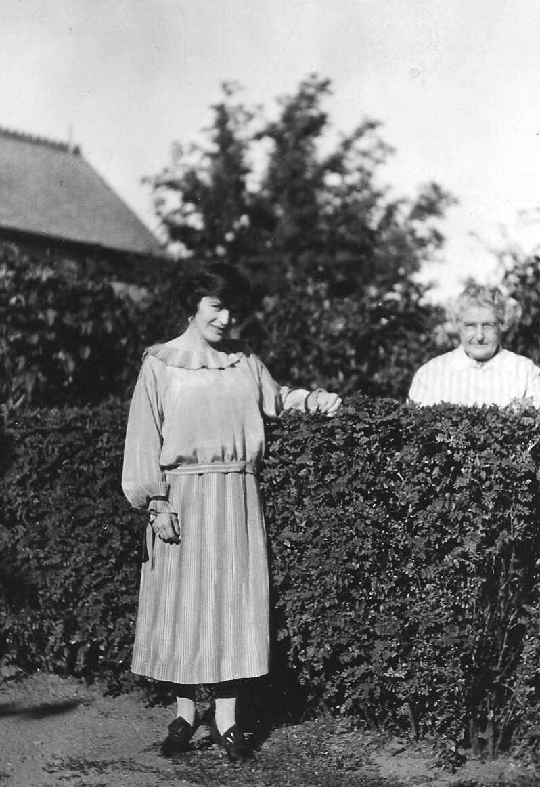{width="6.756cm"
height="9.837cm"}{width="5.773cm"
height="9.897cm"}

He often refers to her silliness when he writes to May: "I got a
particularly giddy letter from Oose yesterday. She says she met a gink
who works in Stovels by the name of Bannerman. She says he is a cute kid
and a dinky mustache, etc & etc."

Wilfrid Loses his Sargeant Stripe -- His Aversion to Being an Officer

Wilfrid was a "sometimes" sargeant. He claimed in a letter of Feb. 2,
1917, that he needed to "take down" his stripe in order to transfer to
the Canadian Army Pay Corps (C.A.P.C.). As we shall see later on, this
extra stripe would come and go with instances of Wilfrid working hard
(gaining the stripe) and Wilfrid being naughty (two drunk and disorderly
charges which meant losing his stripe). At this time, however, it seems
clear that to take the clerk position at the C.A.P.C. he believed he had
to be demoted to the rank of Private.

I figure it is worth it to be sure of being safe for a while anyway. I
have had my fill of France and believe me I am only too glad to do
anything to keep away from the darn place in future. However the stripe
was the least of my worries anyway.

However, in his medical board review, he was classified as C3 which
means just one thing: "Sedentary Service at Home Camps." While he
suggests that officer status would somehow jeopardize his cozy desk job,
raise his profile and make him somehow fit for active service again, we
have reason to be skeptical. His letters, as we shall see more clearly
soon, were not always 100% truthful. He may have been somehow averse to
assuming the greater responsibilities that attended officer-class work
in England. He may also have been resolutely determined to never, ever
return to the battlefield (and who could blame him) and felt remaining a
private would keep him well under the radar of official notice, and so
would more conducive to staying in England for the duration. He appeared
to have a running and rather bitter battle with his sister May on this
very issue:

You seem to be quite take up about Percy Kerry getting a commission.
Well, let him get it. That does not make him any better. Lieutenants get
killed just the same as privates, and, believe me, I would just love to
see that same boy over in the trenches during a heavy bombardment such
as we used to go through many times during our stay at Ypres last
summer. He sure will get his eyes opened when he gets over there, ifhe
ever gets up enough spunk to go. It would be a comparatively easy matter
for me to get a commission but there is rather a big expense attached to
it while attending the Officer's Training School\...I guess I will be
just as happy going through this war as a private as I would be as an
officer.

In the next letter to May, he actually seems very defensive about not
being a combatant any longer. He writes about something major about to
happen on the Western front, "and I am very well pleased that I will
miss it all. I have had all I want of it and am quite willing to stay
behind in England. There are plenty of fellows over here who have never
yet been across the channel and who have been in the army longer than I
have, so I figure it it is up to them to get out there and do something
for a change. I wonder if Percy Kerr every got over?"

I Do Like to Be Beside the Sea Side!

His new job was with the Divisional Paymaster's Office, Farley House,
Sandgate. I found this old photo of the building -- which is right on
the seaside\-- on the Web:

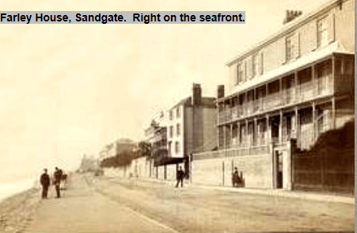{width="11.933cm"
height="7.779cm"}

In a letter to May, he says "The house is situated right on the coast of
the channel. It certainly is a very pretty view and I should imagine it
will be a lovely place in the summer. I guess I have a pretty good time
ahead of me for this year....We have a lovely office here. The whole
side is one row of windows and looks right out on to the channel.

While Wilfrid expected to stay at Farley House for the summer, he was
hoping to be transferred to the C.A.P.C. (divisional paymaster's office)
in London. But, just as he was winding down his work at the C.C.A.C.
(Casualty Assembly Center):

\...the Quarter Master came around and warned us all that the building
was placed in quarantine on account of measles and that none of us could
leave the place for sixteen days. Well, sixteen days did not look very
good to me so I climbed out the window and went down and reported to the
Paymaster, who was at his home at the time. He said I did quite right so
on Monday morning we moved our office and I am now attached to the
Divisional Paymaster's Office.

This sounds like something his son, Robert, would've done. We see the
same kind of daring and risk-taking behavior and a delight in snubbing
authority figures.

It's also interesting to note that in the same letter, he tells his
mother "I am going to be gazetted as a sergeant very shortly according
to what the boss says so I am not losing anything by the transfer." So
much for the story of the requirement of him being a private for taking
the clerical job! He lives in hopes of this transfer to London, the
"main reason I want to get up there\...is that we live in private houses
and \--gee -- but it will be nice to get back to a feather mattress
again."

Richard Buckley wrote to Nellie in the spring of 1917 while he was in
England, and, since he no longer needed to worry about military censors,
he was not shy about commenting on the progress of the war:

We had such good news today from France, over six-thousand prisoners
taken in yesterday's fighting and the Canadians succeeded in taking Vimy
Ridge. We are doing great things in a quiet way. With the U.S. in with
the Allies, the war should not go on much longer. The fighting seems to
be reaching the climax just now, and the artillery fire which opened
yesterday's attack is said to have exceeded any previous bombardment in
intensity, and the aeroplanes make war on each other almost like
infantry. The tanks are again included in the engines of war.

"It Sure is Fine to be Living in a Civilized Place Again"

Wilfrid's transfer to London to work in the C.A.P.C. Chief Paymaster's
office comes about in early April, and he's ecstatic to be living in an
actual HOTEL (the *Shaftesbury* on Great St. Andrew's Street- "285
bedrooms fitted with h. & c. running water in each. Telegrams:
"UNAFRAID", LONDON") so he can walk to work. His office "is right close
to the Parliament Building and the Abbey."

He made a project of visiting the tourist sites, including the zoo at
Regent's Park, Westminster Abbey and Hampton Court. He even had a date
with a London girl he'd met in 1915 (he tells his sister of this but
only mentions the outing -- not the girl -- to his mom).

Despite outings with girls (or one special girl, as was speculated by
his son Robert), it doesn't take long for the bloom to disappear from
the London rose.

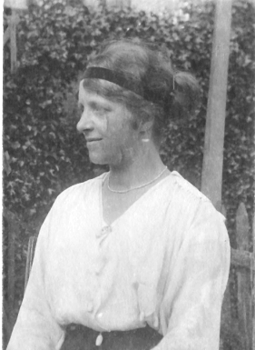{width="6.191cm"
height="8.483cm"}

Photo of "Wilfrid's British Girlfriend" (According to Bob Dunlop)

In only a few weeks, Wilfrid came to believe that Neepawa -- not London
-- was the acme of civilized living, and all because of imposed
rationing of food. On April 27^th^, Wilfrid writes a letter to his
mother that's full of extended complaints about the availability of food
in England:

They have cut down the rations over here again\...For instance every
Tuesday is a meatless day. No meat of any kind can be had. Then again
only two days a week are set apart when you can have potatoes. For
breakfast, dinner or supper you are only allowed two very small lumps of
sugar no matter how many cups of tea you have. No pastries of any kind
can be had if you have a slice of buttered toast with your meal you
cannot have a slice of bread. Only one slice of bread per meal. It is
worse here for restrictions than it was in France. Sugar is a luxury
surpassing what champagne used to be. It sure is rotten not to be able
to get a square meal when you are hungry. No meal must exceed two
courses except between 6:30 and 9:30 p.m. when three courses can be had.
I sure will be glad when I can get back to a civilized land and have a
square meal once more!

In the same letter, Wilfrid remarks that he has "a chance of a
commission" but will ignore it because "officers are in great demand
over in France" and he has no intention of ever returning to the horrors
of the battlefield.

Wilfrid's Letter-Writing Duplicity

We've had hints of it before, with Wilfrid writing one version of events
to his mother, and a different version of the same events to his sister.
But now we can put letters he wrote to his mother side-by-side with
those he wrote to his sister and read two very different -- even
contrary \-- views of the same events.

He writes to May at approximately the same time as the April 27^th^
letter to his mother. In this letter, he states quite baldly: "I am
getting three stripes in a very short time." He could write this on
nearly the same day as he wrote: "I have a chance to take a commission
but I have no thought of doing so at present" to his mother. He
certainly was going to get his "three stripes" (promotion to sargaent)
but it would be as a Non-Commissioned Officer (NCO), in the form of a
temporary appointment.

We know that May had been strongly encouraging Wilfrid to work towards
obtaining his officer commission. Why she was so inclined we can only
speculate, but Wilfrid's justification for not seeking leadership roles
is a constant theme running through the letters to May. At this time,
Wilfrid was desperate for money. He states that "I am hoping to get a
letter from you next week. I am thinking that some of that assigned pay
will be along with it. I hope so anyway as I could certainly do with it.
It is rather expensive living up here as everything is so dear." His
assurance that he was just about to become a Sergeant was pretty clearly
an attempt to get into her good books and loosen the purse strings.

At this time (in his letter of May 5) Wilfrid received a letter from
papa, which was the second or third reference to Alexander writing his
son a letter, destroying the family myth that Alexander never once wrote
to Wilfrid during the war years. He states that papa wrote that Nellie
was ill, which clearly troubled Wilfrid. He asks: "What was the matter?
The old spring trouble?"

He inquires after his mother's health in a letter written at about the
same time to May, so it was very much on his mind. He writes to let May
know that "I received your letter with the big money order in it."

Now, About the Commission

Having got the funds he had sought, Wilfrid finally levels with his
sister, and there's a genuine tone of defensiveness in the letter:

Now, about the commission. I have been thinking this thing over as I can
very easily be recommended for one if I feel inclined to take one.
However, so long as I am classed C3 (medically unfit for active service)
I am satisfied to stay the way I am\...You want to know why I am now
only a buck private. Well, here is the reason. Any man holding stripes
and transfer to the C.A.P.C. (paymaster's office) must revert to the
ranks and come as a private. Well, I was rather proud of that stripe but
I was not going to let it get in the way of getting a soft job so I
agreed to take it down, knowing that if I made good at the work I would
be made Sergeant in due time."

May's insistence on Wilfrid becoming an officer is a continual refrain
in these letters. She clearly felt it downgraded the family's social
status within the town, as she often writes to tell him of other Neepawa
boys who obtained commissions in an effort to shame him into acquiring
more ambition in his military career.

Wilfrid references a question she posed in a subsequent letter written
in late May: "You asked me if they were in the habit of transferring us
around from one branch to another also if my move up to London was a
promotion." This, together with what must've been continual harping on
his lowly status as a Private, suggest that May was very focused on a
perceived lack of ambition on Wilfrid's part, and communicated this
clearly in her frequent letters.

The pressure from home to work his way up in the ranks must've been a
source of great stress. His main aim after recovering from his wound was
to stay in England, at all costs. And, if this meant remaining a
private, it seemed a small price to pay for the privilege of never again
entering a trench. He made it very clear that pursuing an officer's
commission (through a lot of training) would very quickly land him back
in trench hell, and that was a place he would never willingly return to.

Also, the business of rising through the ranks was slightly complicated
by the fact that temporary promotions had become the norm. It was very
common for men who held the rank of Private to be given temporary
promotions because of a shortage of commissioned officers to fulgill the
role of sargaent or corporal. These acting ranks were given and taken
away as the need arose, and there were no negative connotations when a
man with a rank of Acting Sargeant or Corporal was required to surrender
his rank as circumstances changed -- and this typically occurred when a
soldier was moved elsewhere. In none of the letters does Wilfrid attempt
to describe the difference between a permanent and an acting rank. He
simply states that he has been promoted to Sargaent, for example.

The records show that Wilfrid's permanent grade -- the rank he held
thoughout his military career \-\-- was Private. We also know that
Wilfrid was made "Acting Sargeant with pay of rank" in December, 1917, a
few months after he moved from his clerking role at the Paymaster's Corp
in London, to the Canadian Army Medical Centre at Bramshott.

As an NCO, receiving "pay of rank" would have been a very big deal
indeed. Privates only received \$1.00 a day, not much even by 1917
standards, but Sargeants received a 50% increase, receiving \$1.50 a
day. And why on earth would you go to all the trouble of pursuing a
commission to get the higher rate of pay you could quite easily get by
accepting a temporary appointment -- and without the risk of being sent
into battle again.

Clerk Extraordinaire

Just as soon as Wilfrid got himself his first clerking job in England,
he started typing his letters. They're evidently typed with genuine
expertise and fluency. Wilfrid's evident skill with the typewriter (a
skill acquired at his father's press?) must've made him an absolute
standout.

Clerical work was a very common white-collar job in those days. As many
as 18% of Canada's expeditionary force attested to being "clerks" when
they joined up, but, of those calling themselves "clerk," only a small
number would be capable of typing with any degree of proficiency. In
Canadian offices, writing by hand in ledgers was the norm. Typewriters
were very expensive (about \$100) and were not yet standard equipment.

I suspect Wilfred was exposed to the then high-tech world of mechanical
typing at his dad's press. Regardless of how he acquired the skill, it
would certainly set him apart, and typewriters were more likely to be
found in English offices than Canadian ones. Anyone with typing
proficiency in the CEF would be in demand:

I can get an escort trip whenever I want one but then I cannot always
spare the time away from the office. It would be different if I had
someone in the office who do the typewriting. (Dec. 30, 1917)

This suggests how highly valued Wilfrid's typewriting skills were, and
how he may have even owed his life to his skills at the keyboard. I
suspect Wilfrid was encouraged to remain in a clerical capacity even
after his leg no longer prevented him from returning to the trenches,
his typing and office skills may have been prized sufficiently to keep
him safely in England even after he was declared fit again.

Just before landing his most responsible job (orderly room clerk with
potential for becoming the staff Sargaent), he writes to May, saying:
"the colonel wants me to stay on, as all the men on the staff at the
hospital are being returned to the depot to train for France and they
are going to be very short of efficient help."

Indeed, in September of 1917, when Wilfrid's 5^th^ battalion was smack
dab in the middle of one of the most horrific engagements of the war,
the Battle of Passchendaele (a.k.a., the 3^rd^ battle of Ypres), Wilfrid
was declared fit for active service. But by some miracle, Wilfrid was
spared from returning totheYpres hellscape he knew all too well.

In a letter to Nellie dated September 15^th^, 1917, Wilfrid reports that
thing he had feared so deeply -- being declared fit to return to active
service -- had just happened:

I have been classed as fit again but am being transferred out of the
infantry into the Canadian Army Medical Corps. I do not know what the
idea is but I suppose it shall be better than back at my unit.

In the same letter, and in several more afterwards, he writes about
applying for an officer's commission. These were placatory letters,
written to keep his family sweet. The subsequent letters to the
Dragon-Lady sister, May, go on rather a lot about how expensive it will
be to attend the Cadet School, buy the cadet uniform and kit, etc. --
all to pursue the commission the family is so keen for him to obtain.

There was likely a pecuniary interest in going through the motions of
becoming an officer. As long as he kept May's hopes of his becoming an
officer alives, she would cable him the occasional cheque. Whenever he
received one of these cheques, he would take time off on leave and
assure May that he would be "having a grand time" thanks to her timely
remittance.

Life at Bramshott

Wilfrid would've enjoyed staying on in London at the Paymaster's Office,
but, once he was declared fit in September, 1917, he had to leave "the
infantry" and join the Canadian Army Medical Corps in Bramshott.

Wilfrid disliked Bramshott. He said, "I was down to Bramshott about a
month ago on duty and believe me it is an awful hole." At the time, he
thought he'd be posted elsewhere with C.A.M.C.: "I am glad that I shall
only be there a very short time."

But it was to Bramshott Wilfrid was posted, specifically to the No. 12
General Hospital (Annex), where he was assigned to work at clerical
duties as a member of the office staff. That "short time" became, if not
the remainder of the war, at least the next year of service.

Once again, he declared his intention to go through for a commission in
the Imperial Army, but, in October, the Canadian Army medical board
rescinded his "fit" designation and put him back to "C3" category --
which means he was again considered fit only for a desk job. He asked to
be brought before another medical board, but reports in a later letter
of October 28^th^ that the board "raised my category up a few notches to
B1 but still I am not classified as fit."

By the end of October, he largely gives up the quest for a the
commission and resigns himself to the mundane routines of his new job in
the Orderly Room at No. 12 -- routines that he seems to have rather
enjoyed.

Promotion and Other Successes

Despite the occasional bout of despondency, he soon had cause for more
optimism. His organizational and typing skills were recognized, and by
November of 1917, Wilfrid was promoted to Sargeant Clerk and put in
charge of the orderly room. His letters indicate that he worked long
hours and relished his position of responsibility.

\...I have at last got my promotion to Sergeant. I have been put in
charge of the orderly room and taking things all round I have a splendid
job. I have a spring bed and mattress to sleep on. We are fed very well
indeed at the Sgt.'s Mess and a little increase in pay helps to make the
darned old army worth while. (November 9, 1917)

It wasn't long before Wilfrid was rewarded with a promotion to acting
Staff Sargaent, with pay of rank -- the highest acting rank that a
non-officer could reach.

Wilfrid's letters from this period indicate that he thrived on the work
(he excelled at clerkly duties, including typing -- we note all his
letters were typed with great proficiency) and enjoyed many privileges
such as leave for travel.

When writing to May, he still referred to Bramshott as an "unearthly
hole" but seems to be generally happy with this situation -- and
sometimes even ecstatic. There are frequent references to a certain
"Mrs. Cowlishaw" and "one of her daughters", both of whom send him
letters and invitations to visit them at Stoke on Trent: "You can bet
your bottom dollar I am going to accept!"

1918 Malcontent: Increasingly Restless

Although largely content with his promotion and hospital clerical work,
by early 1918 we hear once again, the letters reflect a growing
restlessness. He writes to his mother in January of that year: "I shall
be satisfied to stick right here for the duration. I have a dandy job
and everything else about it is all that could be wished for....but
sometimes I feel like asking to be marked fit and go out to France again
and have it out one way or another, either get so badly knocked about
that I will be useless to the army *or get the other thing."*

Wilfrid had been away from home for three years now. His impatience with
army life and what must've been stupefyingly dull clerical work at
Bramshott hospital becomes more obvious. He even betrays a rebellious
streak to his "dear mother" which he would've carefully hidden in the
past. In the same letter as above, Wilfrid declares:

I do not wear my good conduct stripe now as it is only to be worn by
those junior to the rank of corporal\...If I stay in the army for twenty
eight years and behave myself all that time, I shall be entitled to wear
four of them???????????????????????????? a fellow deserves a million of
them if he behaves himself in this army for that length of time.

The same day (January 11, 1918) Wilfrid wrote a letter to his sister,
May. The main purpose of that letter (as were most of the letters to
May) was financial, to underscore the importance of sending him money
ASAP so he could enjoy his upcoming 4-day leave in London. However, he
also mentions a very tempting invitation to spend a few days with Mrs.
Cowlishaw (she with the lovely daughters) -- which he had not mentioned
to his mother. He also thanks her for sending him his favorite magazine,
Redbook. At the time, Redbook was not so much a woman's magazine as it
is today but "\"the largest illustrated fiction magazine in the world\"
with fiction by Jack London, Sinclair Lewis, Edith Wharton, etc. Stories
were about love, crime, mystery, and the old west.

His letters became much less frequent in 1918 -- and he writes much less
to May than he did. Only one more letter was sent in January of that
year,to his mother and, despite its initial cheerfulness, Wilfrid again
betrays a desperate impatience and discontent:

I suppose the war will still continue to run on the same for another
year. If it does not take a change very soon, I am going to try for
furlough to Canada. I wish papa would put in an application from that
end to ottawa to get me three months furlough on compassionate grounds.
Other fellows are getting it that way. Why cant I?

In his letter of February 4^th^, Wilfrid reflects on the new Canadian
draft, the first conscripts of which were expected shortly. Here he
states his view on the war quite plainly:

Is there any chance of Blake (his much older brother) being raked in on
that scheme? I hope not as it is no life for a human being. I have to
realize that after it is too late.

He also has come to realize that he will never be granted leave to
return before the war is over: "I had had a couple of tried to make
Canada but it was no use. A man who can do clerical work has very little
chance of getting back."

Staff Sargeant Dunlop

Things started looking up in March of 2018 when Wilfrid was promoted to
Staff Sargeant, a promotion that was certainly well-deserved, even if he
had worked only half as hard as his letters claimed. He received a
slight increase in pay, which, as usual was directed to be managed by
his sister, May, the awkwardness of which is a continual refrain in the
letters:

I shall be unable to increase my assignment, as I said I was, on account
of new Army orders. It seems pretty rotten that a fellow cannot have his
own money but it seems the way of things in the army.

At the time of his promotion, the letters reflect an altogether brighter
mood as spring began to stir:

The warm weather is coming on now and the country is looking lovely.
This sure is a wonderful country when the weather is right. I hope it is
like like this when I get my leave. I shall see Scotland at its best
then.

Wilfrid had an abiding urge to visit Scotland, the ancient land of the
Dunlops, even though we know the Dunlops actually spent many centuries
in northern Ireland as part of the 16^th^ century protestant plantation.
Regardless, his desire to go there is very keen and repeated throughout
the letters of this period. He even badgers his mother to send all his
savings so that he can make the trip "before I am classed fit and sent
over to France\...I should not be at all surprised if I should be sent
over again even sooner than I expect."

Finally, in mid-May of 1918, Wilfrid manages to get a ten-day leave and
travels to Edinburgh, Glasgow, Stirling and Carlisle (northern England).
He also spent three days at Stoke-on-Trent visiting the Cowlishaw's. In
his letter to his mother written immediately on his return, all he has
to say about Scotland is "it certainly is a beautiful part of the
world." He reserves the greatest enthusiasm for his stay with the
Cowlishaw's, where he had "a real good time." He is even more effusive
in his letter to May: "I have a regular home there now and I am getting
in stronger than ever with the whole family."

In mid-June, it becomes clearer that Wilfrid has a special friend in one
of the Cowlishaw's daughters. He sends some photos to his mother "taken
at Stoke-on-Trent and I guess you will know who took them. They are much
better than I expected they would be as we were acting the fool all that
afternoon."

Stricken with Influenza

In July, Wilfrid was "laid up in bed for about ten days with influenza.
I had a pretty stiff attack of it and am just nicely getting over it
now. I had a temperature of 104 the greater part of the time."

Wilfrid was infected by the Spanish Influenza virus that swept through
the western world with grim results. During the pandemic of 1918/19,
over 50 million people died worldwide and a quarter of the British
population were affected. The death toll was 228,000 in Britain alone.
Global mortality rate is not known, but is estimated to have been
between 10% to 20% of those who were infected.

Few families were unaffected by the pandemic. Wilfrid married my Granny,
Leona Newton in Minneapolis a few years after the war. Leona's dearest
sister, Mabel, lost both her husband, Jake Fountain and their
12-year-old daughter to the same epidemic.

The Inevitable Has Happened\...

With something like relief, Wilfrid announces that "the inevitable has
happened -- at last. I have been marked fit and am now beginning to
figure on making another trip across the channel\...I have put in my
application for for a commission in the Royal Flying Corps but I know
very well that I shall never pass the medical examination as they are
very strict so far as the heart, lungs and nerves are concerned\...If I
fail to pass I shall go back to the infrantry and go over to France
again. Then I shall put in for a commission from that end."

He remarked to his mother that one great thing about going back into the
infantry is that "they have harder work and all that but there is better
chances of getting "Blighties" and they come quicker than with other
branches of the army." In other words, even though your chances of
getting killed are a lot higher in the trenches, your chances of getting
horribly wounded are very high as well, so, with luck, you'll get sent
to hospital a lot quicker than with any other branch of the armed
service.

Wilfrid's announced intention to apply for a "commission from that end"
is clearly another attempt at family appeasement. The ongoing pressure
from his sister May, in particular, to achieve the higher status of
officer class must have been relentless. In July he writes a fairly
testy letter to his sister answering questions she'd put to him, all of
which related to his status. It's worth quoting this at length to
understand just how stubborn was May's continuing focus on the fact that
Wilfrid still had a permanent appointment as a private -- despite the
fact that he had been appointed an Acting Staff Sargeant only a few
months before in March:

You ask if I am entitled to wear service chevrons, The answer is "yes".
At present I am entitled to three\...You ask if I wear three stripes, a
red cross and a and a crown. The answer is "yes." You also ask if it is
quite correct that I have applied for a commission. The answer is "It is
quite correct." You say I must have one grand and glorious time over
here. Well, to tell the trush, I am having a rather nice time,
especially when I go up to Stoke on Trent. \...In this war business it
is a case of eat, drink and be merry for tomorrow you may be dead.

Sadly, we can't read May's letters, but from his tone in this and
several other letters, she was a snob of the first order and a truly
royal pain in the ass. About a week later, he sends his watch to his
mother for repair (repair that would be expensive and lengthy in
England), and adds that "May has a hunch that I have pawned it long
before this\...well, you will be able to write and tell her that it is
still at large."

A general tone of weariness and malaise infiltrates the letters of 1918.
Wilfrid's homesickness of 1915 and '16 has been replaced by a clear and
growing sense of emptiness and hopelessness. His job must've been boring
in the extreme (clerical work at a hospital), and all he had to look
forward to was the occasional leave, preceded by begging from his
unsympathetic sister for some of his salary to be cabled to him: "It is
just about three years now since I left home. It seems longer than that
to me."

Called to Headquarters!

In early September, his letters come to sparkling life as Wilfrid's
hopes for a commission and successful admission to cadet school appear
to be immanent. He was called to Headquarters, Bramshott area where he
was interviewed most kindly and hopefully by a colonel J.G. Rattray, who
knew Wilfrid's father ("old Alex") well as a curling competitor, and who
said Wilfrid did not slightly resemble ("you look very much like your
mother"), except perhaps in temper.. Rattray said he would do what he
could to get his application accepted. Everything was looking very rosy
indeed: "On my application I have the recommendations of a brigadier
General (H.M. Dyer), two full Colonels and one Lieut. Colonel. That
sounds pretty good, doesn't it?"

Finally, Wilfrid's luck was about to turn. His mundane and lacklustre
clerical life, which evidently disappointed his family, was about to be
transformed into something much more glorious. He was to become an
officer. Finally, Wilfrid was going to make his family proud and return
to Canada with an officer's chevron on his shoulder.

Artillery Training at Witley Camp

Sadly for Wilfrid, becoming an officer was not in the cards. He
certainly did go the C.R.A. (Commanding Royal Artillery) camp at Witley
from September 23rd to October 28, attending the Witley's School of
Gunnery. His prospects at the time seemed very promising. He was now on
the standard Canadian officer-training track, and, after his artillery
training at Witley, the next step was "to return to Bramshott and await
instructions to proceed to an Imperial Cadet School to qualify for my
commission." But while he was in Witley, he contracted a venereal
disease, with all the expected health- and career-damaging effects, and
his imperial commission (*not *Canadian, -- he expresses a very clear
preference for becoming instead an English officer) would remain forever
beyond his grasp.

In the meantime, though, he was actively involved in artillery training
at Witley, and it would seem that he really enjoyed getting "down to
soldiering again after two years of an easy time." As described to his
mother in a letter dated October 5, his daily routine sounds grueling
with little to no free time:

We start in at 5:45 am and finished up at 4:30 pm and then study until 9
pm, which is the time I get into bed. I shall be here for two months and
maybe more. Then I sll be at an Imperial cadet school for 3 or 4 months
before being finally gazetted.

We note here a mysterious change in the training timeline: what he had
asserted would be exactly one month of artillery training at Witley is
suddenly upped to two-plus months. We may speculate that Wilfrid knew at
this time that he had Gonorrhea and was scheduled to enter one of the
many Canadian military VD hospitals operating in England -- which
coincidentally was located in Witley as well.

He adds a note about his mailing address at the end of the October 5
letter:

I want you to keep on addressing my mail to Bramshott and they will
forward forward it on from there. The reason is I do not know just how
long I shall be here and I do not want to take chances of any of my mail
going astray.

In a letter a week later, Wilfrid writes that "both Bramshott and Witley
Camps have been placed in quarantine and the result is we cannot leave
our own lines. The "Flu" epidemic is hitting us very hard and within a
week there were over forty deaths at Bramshott hospital."

In that same letter, he mentions a friend of his from the 78^th^
battalion who had recently been killed in action: a Winnipegger named
Clifford Neelands who had risen to the rank of Lieutenant. He says no
more than that he had been sorry to hear about it. However, a little
digging in Canadian WW1 service records reveal that he had been
hospitalized at a "special" (i.e., venereal disease) military hospital
at St. Albans for 2 ½ months at the end of 1917 for V.D.G. (Venereal
Disease Gonorrhea).

He was declared fit in early 1918, having received the standard
two-month treatment of "irrigation and vaccine", shipped out to France
with a group of 78^th^ battalion reinforcements, and killed in action
six months later on August 11, 2018, on the third day of the Battle of
Amiens, the final allied offensive that led to the end of the war.

Clifford Neelands was unlucky to have been killed so close to the end of
the war. He was also unlucky to have contracted a venereal disease and
endured a long, humiliating treatment, just like Wilfred. Neither of
them, however, were by any means uniquely unlucky. Both death and
venereal disease were rampant during World War 1.

There were 418,052 men registered in the Canadian Expeditonary Force
across the entirety of the war. By the end of the first year of the war
in 1915, it was reported that 30,000 men were infected with venereal
disease. By the end of the war, this number had grown to a final report
of 66,083 cases (Cassel 1987) -- approximately 16%. During the First
World War, VD caused nearly half a million (416,891) hospital admissions
among British and Dominion troops (Mitchell & Smith 1931: 74). Of those
infected, the great majority contracted Gonorrhea, a condition much more
curable than syphilis.

\[Webster Davis was another unlucky Neepawa lad mentioned in the batch
of letters written while Wilfrid was undergoing the cure. Only 19 years
old, he's joined the forces in 1917 and was killed in action only five
weeks before the end of the war on September 28, likely also at the
Battle of Amiens.

Secret Disgrace; Secret Address

From early October of 1918 perhaps to the end of his time overseas,
Wilfrid's letters become predominantly fictional. He became infected
with Gonorrhea, perhaps early on in his time at the Witley artillery
training camp,and was admitted to the Canadian Specialty Hospital Witley
on October 17. He was not discharged until December 2^nd^, and had to
endure nearly two months of a strictly isolated hospital stay that
featured the only known cure: a thrice-daily regimen of humiliating and
painful irrigation of the urethra.

His letters from this period are very few indeed. In fact, there's a
lapse in the extant letters at this point:There are no letters for
several weeks, from October 12^th^ to November 3^rd^.

Then, when the letters resume, Wilfrid describes a hugely successful
training experience. To his sister May he writes: "Everything is going
along nicely. I have passed all three exams in gunnery and I go in for
the final next week. " To his mother, he writes: "It is some time since
I have written to you but I have been kept exceptionally busy of late
with examinations." Of course, we know he did none of these things.

He also reiterates the importance of his family continuing to send his
mail to the address of his previous posting at Bramshott hospital: "Keep
on addressing my mail to the hospital at Bramshott. A great friend of
mine up there looks after it and keeps it for me." To his mother he
writes: Keep on addressing my mail to Bramshott. It is only 8 miles away
and I go up there every Sunday."

In every letter, he ends with an injunction to both his sister and
mother to continue sending his mail to Bramshott. If mail had been sent
to the training camp at Witley, it might have been returned to sender,
as he had left the training facility in mid-October when admitted to
hospital, which would've raised suspicions regarding his actual
whereabouts.

We can only imagine how difficult it must've been for Wilfrid to keep up
the charade of continued artillery training in his letters home. But it
was absolutely essential: he could no more have given them the address
of the Special Hospital in Witley than he could have informed them of
his medical condition. The double shame of debt and frivolity that had
marked him as something of a black sheep to his highly aspirational and
respectable family -- especially with a "papa" who was the moral and
highly vocal pillar of the Neepawa community -- would count as nothing
compared to the shame of contracting and then requiring treatment for a
venereal disease. Honesty would have ruined him for life.

Admitted to Canadian Special Hospital Witley

We know from his Venereal Disease Case Card, dated October 17^th^, that
Wilfrid contracted the disease "in Grayshott two weeks ago". So, if his
words as recorded by the medical clerk are to be believed, he was
infected sometime early in his artillery training. Grayshott is a
village about an hour's walk from Witley Common where the training took
place, so this is the likeliest scenario.

Prostitutes were legion in England at this time. Involvement in
large-scale fighting on foreign soil always means extreme privation at
home, so many women turned to prostitution to keep their children fed.
And since Canadians were paid far more than the English (although you
might not think so from even the briefest perusal of Wilfrid's many
cash-begging letters), the Canadian uniform was a magnet for local
prostitutes. It's more than likely that Wilfrid became infected this
way, but regardless of how it happened, in those pre-penicilin days, the
cure was painful, long and humiliating.

From October 17 to December 2, he was forced to submit to a very strict
hospital regime that likely involved pretty much constant irrigation of
his urethra by a medical attendant.

Before penicillin the only successful approach was constant and
strenuous disinfection by skilled attendants. The soldier was first
washed with soap and water, then with mercury perchloride. Mercury was a
common treatment for all forms of VD due to its extreme toxicity.
Although the negative side effects were well known, it was believed it
was more important to ensure the patient was cured of VD than to worry
about these effects (Hayden 1901).

Once thoroughly cleaned, the soldier had to submit to a regimen of
enforced bed rest and thrice-daily injections of argyrols or protosil
directly into the urethra and a health care professional would
thoroughly wash the genital area with calomel ointment to sooth any
irritation.

The Canadian military was unsparing in the documents it scanned and
posted online for WW1 veterans' relatives. Thanks to their scrupulous
scanning, we have the full nearly daily record of Acting Sargeant
Dunlop's progress through this two-month ordeal. When he starts
treatment on the 17^th^ of October, it's noted he's suffering from
influenza with a temperature of 102. The treatment for this is described
in one word: "enema". It's no wonder so many service men died during the
great flu pandemic of 1918!

His thrice daily injectons begin to work, however, and he's described as
"improving" throughout the remainder of October. But then the situation
takes a troubling turn on November 5^th^, when it's noted that his
"right testicle is greatly enlarged." A day later, the treatment changes
from irrigation to "punctured with needle. Pus obtained. Groin painted
with iodine". Not surprisingly, the secretions and enlargement continue
until the 11^th^, when it's noted that the "swelling of testicles has
gone down." His condition improves slowly until the final entries at the
end of the month, where it's noted that his infection is now "dry".

The End of the War at Last

Almost all of his fictionalizing came to the same end with the war on
Armistice Day, November 11, 2018. He no longer had to continue to
pretend that he was at Cadet School, which must've been a huge relief.
He wrote to May a few days after that: "The good news came rather sudden
although not unexpected. I guess it means the end of my aspirations for
a commission but I don't care a darn about that. I can count on getting
home for sure now and that is more than I could do a week ago." He adds,
somewhat dolefully, "I qualified in the final exam but that does not
amount to anything." He wrote this letter during the final week of
enforced bed rest at the Canadian VD hospital in Witley.

The end of the war could not have come at a more propitious time for
Wilfrid. It meant to come up with a credible reason for his failure to
be called to the Imperial Cadet training corps. The end of the war was
made to order and the best possible excuse for failing to meet his
family's aspirations for him to become an officer. One can almost hear a
sigh of relief when he writes, "The Imperials have stopped recruiting
already and will be gazetting no more officers."

However, we know he was not discharged from the VD hospital until
December 2^nd^, so he still needed to explain why he was not being
returned to his unit. The excuse he came up with was pretty good. On
November 15^th^, with two weeks remaining in his hospitalization, he
states: "At present we are under quarantine here (Spanish flu) so I
shall have to wait until that's lifted before I proceed. I expect to go
in about two weeks time."

Clerical Career Restored at CAMC Depot

All Wilfrid's necessary lies came to an end on December 2^nd^ when he
was returned to active service. In a letter of December 5^th^, he writes
that "I have left the Cadet School and been sent to the CAMC Depot. I
came here on the night of Dec. 2 about 11:30 p.m. First thing Tuesday
morning I had three different offers of clerical work and took one of
them. I am working in the Orderly Room and have been promoted to
Corporal." At last, his letters have the ring of truth, optimism and
cheerfulness. To his sister May he adds, "As soon as they found out I
was a clerk they were after me hot foot and I had three offers right
away."

There's still room for some duplicity, however. Wilfrid begs his mother
to prod his sister May to send him 10 pounds "to pay off my outstanding
mess dues at the Cadet school." He certainly did need money for an
upcoming leave, but it was mostly because he received no salary at all
during his two-month stay at Witley hospital. If a Canadian soldier
required treatment for a self-inflicted injury (and VD was considered
just that) he would receive nothing from the military during his
treatment.

The Struggle to Get Back Home

Wilfrid was now residing at the Risboro Barracks of the CAMC Depot in
Shornecliffe. Mysteriously, we have no letters for the remainder of
1918, which could be explained by his upcoming long leave from the
12^th^ of December to early 1919. When he returns from his leave early
in January of 1919, he's kept very busy "preparing low category men for
return to Canada. I will be might glad when I starting getting my own
documents ready."

His impatience to get back home grows with each letter and each failed
attempt to get the authorities to cooperate. Wilfrid figures he should
have somewhere in the neighborhood of \$500 from the military with which
to start his new life. He very rightly worries about getting a job in
small town Manitoba and seems to be asking for parental help: "How about
a good government job???" In a later letter to his sister, Wilfrid
states more explicitly, "I was thinking of getting Papa to land a
government job for me for a year or so. He ought to be able to do it."
One thing we do know about Wilfrid's Papa: He did not believe in cutting
corners for anyone, especially his son. His failure to write or provide
very much in the way of support or comfort during the last four years
confirm that, but Wilfrid continued to hope (in vain) that his father's
political connections would be deployed to help him out.

Wilfrid's desperately hoped to get home as early as February, 1919. In a
letter to his mother on February 2^nd^ he states that he has "high hopes
of beng out of it soon" because "category A men (long service men who
have seen service)" are next on the list of returning men:

I am parading to the O.C. tomorrow and am going to spring a line of talk
at him that will make the tears run down his cheeks. I sure am going to
make an awful fight for it and if I am successful should be saying
good-bye to England about March first.

His hopes were strong enough that he actually sent a brief telegram to
his mother on February 8^th^ that states, "Coming home cable ten
pounds". However, a later letter to his sister attests that his "awful
fight" for returning did not succeed. The O.C. "turned me down flat."
His hopes of going home were dashed: "It is rotten to think of having to
stay over here for the summer. I am only wasting good time staying
here." Apart from the frustration of not seeing his family despite the
fact that the war was over was made worse by the feeling that "If I do
not hurry back ALL the good jobs will be taken."

A letter a few weeks later to his sister seemed more despondent (and, as
it turns out, much more realistic): "From the looks of things it will be
another four or six months before I hit the trail for home." This was a
correct prediction as he did not arrive back in Neepawa until June.

Wilfrid even schemed in his letters to get his ticket home by playing
the "new cadet" card (a ploy to get more money from May because he'd
need to buy a uniform for the trip back home). We know this was a
manipulative ploy for cash because he could not have possibly taken his
cadet exams because of his hospital stay.

His other scheme (perhaps the only genuine one) was to "train someone in
the Orderly Room in my work" and then ask the O.C. to send him back on
escort duty. But this didn't work.

We can only speculate that Wilfrid's well recognized clerical skills
were needed too much as the Canadians returned home. There was much
documentation required at discharge and there had to be someone around
to do that. He represented an essential service and he could not be
spared to return home until everyone else had been processed.

He discovers that this is indeed the reason for his extended stay and
for his O.C.'s refusal to budge: "My O.C. has listed me as an
experienced clerk and indispensable." This was undoubtedly a dismal
prospect for Wilfrid, and no doubt had a lot to do with what we now know
was a pattern of drunk and disorderly conduct. The sense that he was
permanently shackled to dull, repetitive clerical duties, combined with
his failure to become an officer and his need to build an elaborate
structure of lies to keep his recent descent into the shameful abyss of
venereal disease and its treatment a secret from his family -- all of
this maybe too much to bear.

Drunk in the High Street

It was around this time that Wilfrid's war records reveal he got himself
into some serious trouble.

He was officially reprimanded on two separate occasions in 1919 "for
being drunk in the High Street at Folkstone." And he was deprived of his
cherished Corporal status.

Appendix: War Diary Entries

Here's the Wikipedia description of the Thiepval Ridge assault actions
of Wilfrid's 1^st^ Division:

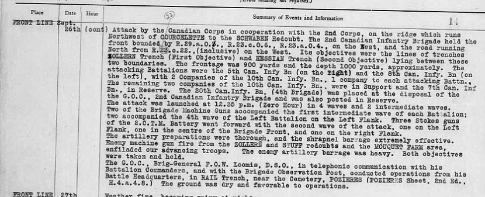{width="17.59cm"
height="7.14cm"}

But the best war diary entry I ever read was the 5^th^ Battalion diary
for that day:

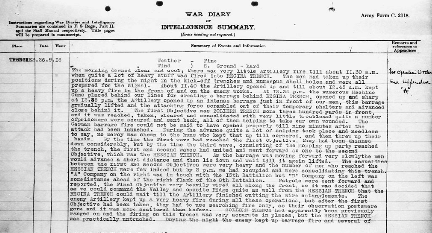{width="19.59cm"
height="10.594cm"}

5^th^ Battalion Diary for April 24, 25 and 28, 1916

Entry for April 24^th^

Enemy started a most intense bombardment on our front commending about 2
p.m. and kept it up till 6 p.m. *utterly wiping out our front line*. He
used all calibre guns and trench mortars. Our own artillery replied most
effectively, absolutely demolishing his trench system on HILL 60. After
the bombardment had finished one of the enemy was noticed waving a white
flag from the remnants of the trenches. The casualties were very light
considering the intensity of the bombardment and the weakness of our
trenches. Whole trenches were completely blown in and when the
bombardment ceased our men were just holding small holes here and there.
The morale of the men was excellent throughout it all. The Bttn was
relieved by the 2^nd^ Can. Bttn., the relief not being complete until
4:00 a.m.

Casualties: 11 men killed, 6 men missing, 51 men wounded.

Entry for April 25^th^

The bttn. did not get back to billets until 8 a.m. They slept all day.
Corps commander sent a congratulatory wire to the Bttn on the operations
of the 24^th^ which read as follows: The Corps Commander wishes to most
sincerely congratulate the Colonel Dyer and 5^th^ Battalion on the
splendid staunchness and resoluteness exhibited during the heavy German
bombardment yesterday.

Entry for April 28^th^

The battalion was specially inspect the General Sir Douglas Haig in the
afternoon. He sent the following message to them: "I am proud to have a
Battalion of this description in my army and wish to thank you for the
magnificent gallantry you have displayed."

Division 1 Diary Entry for April 24^th,\ ^

Hostile artillery very active on the 24^th^.

During the morning the enemy threw several large Minenwerfer bombs int
our trenches opposite HILL 60. Bombs were over three feet long and a
foot in diameter. About 5 a.m. enemy's Minenwerfers were active and
appeared to be coming from behind HILL60. From 8 am the enemy's trench
mortars kept up an irregular fire until 2 p.m\...the enemy then started
shelling and put in over 100 shells, a large proportion of which were
gas shells.

At 3:15 p.m. on the 24^th^ the enemy opened fire on our front opposite
HILL 60 with 77 mm. Guns, 4.1. Hors. And guns, Minerwerfers and small
bombs. Barrage of fire was formed behind our front line and until 6 p.m.
the bombardment was intense, large Trench Mortar bombs falling at the
rate of ten a minute while heavy guns and howitzers also bombarded.

1^st^ Battalion CMR: Diary for June 2^nd^ ( Devastating First Day of
Battle of Mount Sorrel -- Day of Obliteration) re Andrew Mitchell

Battalion occupying Trenches 54 -- 60.

8:30 AM. The Enemy commenced heavy bombardment which lasted until 1:15
PM.

1:15 PM Lt. Col. A.E. Shaw killed at Battn Hqrs during a determined
stand made by him and about 80 others of the Battn., against enemy's
Troops who had succeeded in piercing our line to right of Trench 52
occupied by 4^th^ CMR Battn. The company of this Battn. occupying the
trenches on our right being completely destroyed by being blown up by
one of enemy's mines. After Col. Shaw was killed, Major Palmer took
command and defended the position at BIGO ST. at Battn Hqrs until there
was only two officers and eight other ranks remaining alive and
unwounded. The Enemy having bombed the survivors to one end of the
trench and having no ammunition or bombs to reply to the Enemy's fire,
he gave orders for remainder to get out if they could and retire to SP.
14 and hold on there. As far as it is known only one officer,
Leightenant F.A. Hey and about four or five others were the only ones
who arrived at this point which they found occupied by Leight. A.V.
Evans and a few men with a Colt machine gun. This position was held by
them until relieved, and has since remained in our possession. Out of 21
Officers and 671 Other Ranks who went in to trenches during this tour, 5
officers are reported as killed, 5 wounded and 10 missing, Other Ranks,
total casualties 506, 135 returning.

7^th^ Infantry Brigade Diary for September 15, 16 and 17 (re Richard
Buckley) -- Battle for Courcelette

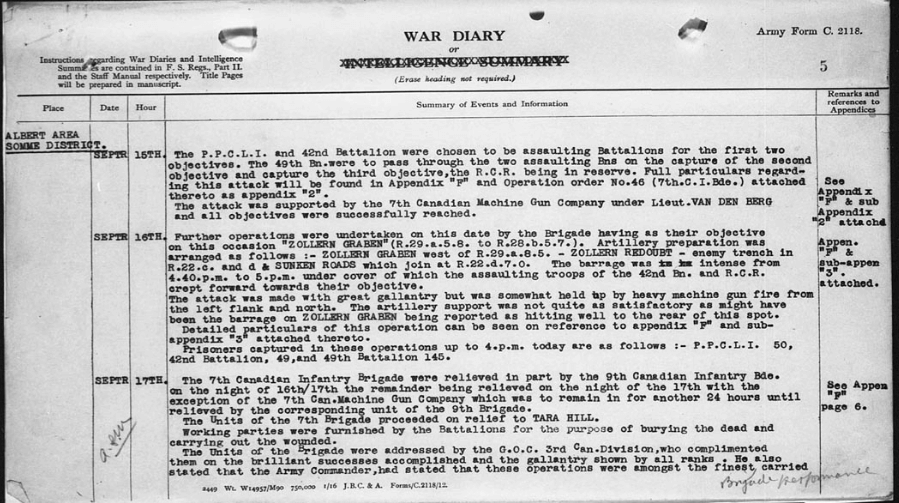{width="17.59cm"
height="9.841cm"}

Battle of Thiepval Ridge (September 26^th^)

Here's the Wikipedia description of the Thiepval Ridge assault actions
of Wilfrid's 1^st^ Division:

The 1st Canadian Division attacked with two brigades. The right brigade
with two battalions advanced 400 yards (370 m) to Sudbury Trench and
resumed the advance at 1:00 p.m., reaching Kenora Trench
[\on
the right which ran north-west back to Regina/Stuff Trench by 2:40 p.m.

The battalion on the left (the 5^th^) had been delayed and German
bombers counter-attacked the flank and were repulsed. The left battalion
had formed up in no man\'s land, to escape the German counter-barrage
but had a harder fight to reach their objectives, taking until
mid-afternoon to reach the second objective, which was just short of the
ridge crest, linking with the left brigade later. The left brigade
advanced with two reinforced battalions, which received machine-gun fire
from the left flank but reached *Zollern* Trench, taking the western
part after a delay. At 1:00 p.m., the advance resumed towards Hessian
Trench, which was taken easily. Touch was gained with the right brigade
but troops from the 11th Division on the left were not found. The
Canadians bombed down *Zollern* Trench and built a barricade, as
machine-gun fire forced a slight withdrawal from the left part of
Hessian Trench, a defensive flank being thrown back from Hessian to
*Zollern* Trench and dug in by 10:30 p.m..

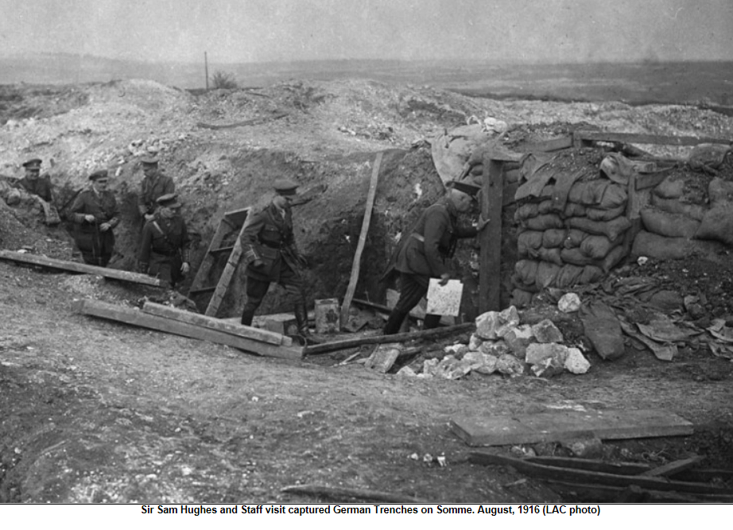{width="17.59cm" height="12.725cm"}
---------------------------------------------------------------------------------------------

Appendix: Venereal Disease Among the Canadians at Bramshott
-----------------------------------------------------------

Canadians were paid more than their British counterparts, and drink and
women were affordable luxuries. Overspending and overindulging were
common. Rates of venereal disease increased, and men diagnosed received
a fine of a half-day's pay for each day they were in hospital. They also
had to give up their field allowance of 10 cents per day.
